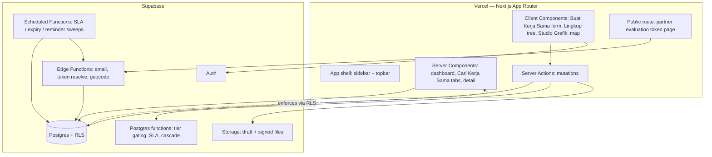

# System Architecture
## Partnership Document Management System — SIM Kerja Sama (SIM-KS)

| | |
|---|---|
| **Version** | 3.0 — aligned to schema v3.0 (`.mwb`) and the SIM-KS UI mockups |
| **Frontend** | Next.js (App Router) on **Vercel** |
| **Backend** | **Supabase** — Postgres, Auth, Storage, Row-Level Security, Edge Functions, Scheduled Functions |
| **Companion documents** | Master PRD v2.2 · Schema v3.0 · Design v3.0 · Rules · `database-sim-ks-2.mwb` · SIM-KS UI mockups |

---

## 0. Read this first — stack decision & one translation

You're building on **Vercel + Supabase first**. Two consequences to hold consciously:

1. **This is a fresh build, not an extension of the live SIMKS (Laravel/MySQL).** The mandate elsewhere in the docs to "extend SIMKS in place" does **not** apply to a Vercel/Supabase build. That means three things become real work: migrating the ~2,289 existing agreements, an auth story (new accounts, not reused SIMKS logins), and a genuine go-live cutover. All three are covered in §12.

2. **Your schema is modeled in MySQL (`.mwb`); Supabase is Postgres.** The schema is portable, but this build translates it: MySQL `INT AUTO_INCREMENT` → Postgres `bigint generated always as identity` (or `uuid`); `ENUM` → a Postgres `enum type` or a `text` + `check`; `TINYINT(1)` → `boolean`; `DATETIME` → `timestamptz`. Table and column names stay as the `.mwb` defines them (Indonesian) so the two models stay legible against each other.

If the team later decides to extend the real SIMKS instead, use the Laravel-oriented notes in §12.3 and treat this document as the prototype architecture.

---

## 1. Why this stack fits SIM-KS

The system's hardest requirements are **data-integrity and access rules**, and Supabase lets them live in the database where no route can bypass them:

- **Row-Level Security** expresses the whole access model (PRD §12) as table policies — the two-axis authorization, "all Active documents readable by any logged-in user," the partner-token scope — instead of application code every endpoint must remember.
- **Postgres functions** hold the two rules most likely to be built wrong — **tier gating** and **business-day SLA with pause** — in one inspectable place, callable from Server Actions, scheduled jobs, and (later) the Realization API.
- **Supabase Scheduled Functions** satisfy the cron requirement the PRD flags as a hard prerequisite (SLA sweep, expiry sweep, reminders).
- **Vercel** ships the Next.js frontend from git; Server Components read, Server Actions write.

Trade-offs to watch: Supabase's scheduler/Edge runtime have execution limits (keep sweeps incremental), and RLS must be written and tested carefully or it silently over- or under-exposes rows.

---

## 2. Shape

The load-bearing boundary: **tier gating and SLA live as Postgres functions, access lives as RLS** — enforced identically whether a call comes from a Server Action, a scheduled sweep, or the future API.

---

## 3. Modules → screens → tables

| Module | SIM-KS screens | Core tables |
|---|---|---|
| **Auth & accounts** | Login | `akun` (role-based), Supabase Auth |
| **Proposal** | Buat Kerja Sama; Proposal tab | `proposal_dokumen`(+`_mou`/`_moa`/`_bidang`/`_agenda`), `partner_pengusul`, `pengusul`, `proposal_dokumen_unit` |
| **Workflow** | Document detail → Approval/Disposition; Discussion | `disposisi`, `disposisi_target`, `riwayat_approval`, `revisi_proposal`, `pending_periods` |
| **SLA** | KPI cards (Melewati SLA), flags | functions over `disposisi_target` + `pending_periods` + `holidays` + `settings` |
| **Lifecycle** | Disetujui, Akan Berakhir, Arsip, activation | `dokumen_kerja_sama`, `penandatangan_petra/_partner` |
| **Renewal & evaluation** | Pembaruan tab; partner token page | `evaluasi` (structured), `partner_eval_token` |
| **Master data** | Settings | `unit`, `jenis_unit`, `jabatan`, `negara`, `partner`(+`_contact`), `agenda`, `bidang_kerjasama`, `managed_options` |
| **Dashboard** | Dashboard tab: KPI cards, Peta Mitra Global, Studio Grafik | read queries + `dashboard_chart`; `partner.latitude/longitude` |
| **Notification** | (email + in-app), Activity Log | `notifikasi`, Edge Function mailer |
| **Integration** *(Phase 4)* | — | read API over `dokumen_kerja_sama` |

**Dependency rule:** master data depends on nothing; workflow depends on proposal; notification is called by others and calls nothing back — it must never block or roll back a workflow transition.

---

## 4. Core domain functions (Postgres)

### 4.1 Tier gating — `recompute_tiers(id_proposal_dokumen)`
Recomputes the whole proposal's disposition state in the current `round_ke`; called after **every** `disposisi_target` status change, **every** add/remove edit, and **on reactivation**. Idempotent. A target unlocks (`waiting`→`pending_action`) when **no lower-tier target in the current round is un-approved** ("no blockers below," so empty tiers skip). Branches on `disposisi.jenis_disposisi` — a `renewal_request` never enters this function.

### 4.2 SLA with pause — `recompute_sla()`
Business-day elapsed time between a target's unlock and resolution, **minus weekends, `holidays`, and any `pending_periods` overlap**. Two scales from `settings`: approval (2/4 business days) and renewal-request (30/60/90 days). Durations frozen on resolution so a later holiday-calendar edit can't rewrite history. Run by a Scheduled Function.

### 4.3 Lingkup cascade — `unit_descendants(id_unit)`
Recursive CTE over `unit.id_parent_unit`; returns all descendants for the tri-state Lingkup selection. Selection is stored as the explicit set in `proposal_dokumen_unit`; the parent's indeterminate state is derived at read time.

### 4.4 Pending reset & renewal linkage
Transactional functions: **reactivate** (close the `pending_periods` row, bump `round_ke`, reset all targets to `waiting`, re-run gating); **link renewal** (link successor via `id_dokumen_sebelumnya`, archive predecessor `superseded_by_renewal`, transfer any Implementation Arrangements). Each is one transaction.

---

## 5. Authorization — RLS as the model

Two axes (PRD §12): a stored app `role` on `akun` (submitter / io_staff / io_admin / viewer) for "what can this account do," and a **derived** approver status (an open `disposisi_target` matching the account's `id_jabatan`) for "can this account act on this document." No stored `approver` role.

Key policies:
- **`dokumen_kerja_sama` / `proposal_dokumen` read** — Active documents readable by all authenticated users (files included); IO reads all; a submitter reads their own; an approver reads documents dispositioned to their position.
- **`disposisi_target` update** — allowed only when the account's `id_jabatan` matches the target *and* the target is `pending_action`. This enforces tier gating at the database.
- **Append-only logs** (`riwayat_approval`, `revisi_proposal`) — insert + select policies only; no update/delete.
- **Partner token** — handled by an Edge Function outside RLS: it resolves a token to exactly one `evaluasi` and exposes nothing else.

The IO Head account carries an elevated app role **and** a tier-1 `jabatan` — both axes at once, deliberately.

---

## 6. Frontend conventions (Next.js on Vercel)

- **Server Components read; Server Actions write.** No client-side data fetching, no API routes for internal use — fewer moving parts.
- **The app shell** (Midnight sidebar + topbar, PCU logo) is a layout; the Dashboard/Cari Kerja Sama/Buat Kerja Sama/Settings pages render inside it.
- **Heavy client components**: the Buat Kerja Sama form (Lingkup tri-state tree, agenda checkboxes), the Studio Grafik Mitra chart builder, and the Peta Mitra Global map are the interactive pieces; everything else is server-rendered tables and detail.
- **Charts & map**: render with a library loaded as a normal npm dependency (e.g. a React chart lib for the Studio's bar/donut/line/area/radar/treemap; a map lib for Peta Mitra Global). Keep the Studio's saved config in `dashboard_chart.config` (JSON) and render from it.
- **Tables**: server-side pagination + per-column filters (the "544 entries" datatables in the mockups); export the filtered view.
- `revalidatePath` after each mutation — simplest correct cache story.

---

## 7. Scheduled & async work (Supabase)

| Job | Cadence | Does |
|---|---|---|
| **SLA sweep** | daily (business days) | recompute elapsed time net of pauses; set flags on `disposisi_target`; dispatch approval 2/4 and renewal 30/60/90 reminders + escalation |
| **Expiry sweep** | daily | archive documents past `tanggal_berakhir` as `expired_without_renewal` (skips Auto Renewed); emit `expiring_soon` on the monthly→weekly cadence |
| **Duplicate partner scan** | weekly | flag likely duplicates for IO — advisory only |
| **Geocode partners** | on demand / nightly | fill `partner.latitude/longitude` from city+country via an Edge Function, for Peta Mitra Global |

All idempotent (reminder timestamps, status checks, advisory output). Email via an Edge Function, dispatched **after** the transaction commits so a mail failure never rolls back a workflow transition.

---

## 8. Files & storage
Supabase Storage, **private buckets**, served via signed URLs behind an authorization check — never public paths. Path by document: `dokumen/{id_proposal}/{jenis}/{uuid}.{ext}`. A revised draft **overwrites** the existing draft object (no version history); `revisi_proposal` is the trace. Signed documents (`upload_dokumen`) persist after archival.

---

## 9. The public surface — partner evaluation page
The only unauthenticated entry point; give it its own review:
- long random token (64 chars) resolved server-side (Edge Function) to exactly one `evaluasi`; no partner data in the URL;
- valid until submitted, then inert; reopen issues a fresh token and supersedes the old `evaluasi`;
- exposes only that evaluation's prefilled section-1 snapshot and answer fields — no document internals, no lists;
- rate-limited; name + email captured as the accountability record;
- carries the full PCU wordmark on Midnight (the trust signal, PRD §16.5); bilingual ID/EN; mobile-first.

---

## 10. Data integrity (enforced, not hoped)

| Invariant | Enforced by |
|---|---|
| Approval order | `recompute_tiers` + `disposisi_target` RLS |
| SLA excludes frozen time | `pending_periods` netting in `recompute_sla` |
| Documents never hard-deleted | app + RLS (no delete policy); archival is a status |
| Auto Renewed ⇒ no end date | check / app rule |
| Archived ⇒ has a reason (`alasan_arsip`) | check / app rule |
| Renewal linkage + IA transfer atomic | single transaction |
| Pending reset atomic (new round) | single transaction |
| Append-only logs | insert/select-only RLS |
| Domestic/international never string-matched | `negara.is_domestic` → `partner.is_international` |
| Tier never inferred from position name | `jabatan.tier_disposisi` |

---

## 11. Environments & deployment
- **Frontend**: Vercel, auto-deploy from `main`; preview deploys per PR.
- **DB & functions**: Supabase project; SQL migrations, Postgres functions, RLS, scheduled/edge functions in version control.
- **Storage**: private buckets, signed URLs.
- **Secrets**: `NEXT_PUBLIC_SUPABASE_URL`, `NEXT_PUBLIC_SUPABASE_ANON_KEY` (public), `SUPABASE_SERVICE_ROLE_KEY` (server only), mail-provider creds (Edge Functions).
- **Separate Supabase projects** for staging and production.

---

## 12. Rollout & migration (fresh Vercel/Supabase build)

### 12.1 Translate the schema
Port `database-sim-ks-2.mwb` to Postgres per §0, applying the schema v3 §9 deltas (merge `parent_unit`→`unit`; `pegawai`→`akun`; structured `evaluasi` + `partner_eval_token`; the added columns and new tables).

### 12.2 Migrate existing data
Migrate the ~2,289 agreements from SIMKS: partners (dedup + reconcile against `negara`, geocode), the unit tree, positions (assign `tier_disposisi`), and documents (mostly landing as `Aktif`/`Diarsipkan`). In-flight documents that don't map cleanly finish under the old system as a fallback.

### 12.3 If extending SIMKS instead
If the team reverses the stack decision and extends the live Laravel/MySQL SIMKS, this Vercel/Supabase build becomes the prototype; keep the same schema v3, but gating/SLA live in the Laravel service layer + MySQL, RLS becomes server-side policies, and there is no data migration (the DB evolves in place).

### 12.4 Pre-launch prerequisites
`jabatan.tier_disposisi` populated; role emails on `akun`; `holidays` seeded; the `unit` tree imported; `negara` list seeded with `is_domestic`; partner coordinates geocoded; approved PCU logo assets + confirmed brand tokens (PRD §16).

---

## 13. Non-functional posture

| Concern | Position |
|---|---|
| **Performance** | Datatables at 544+ rows with per-column filters and joins; index per schema; watch the Active list (every user reaches it) and the Studio queries |
| **Security** | RLS on every table; signed-URL file access; the public token path hardened and rate-limited |
| **Auditability** | `riwayat_approval` / `revisi_proposal` append-only; audit identifies positions, not individuals |
| **Availability** | Vercel + Supabase managed; no self-hosted scheduler |
| **Testability** | tier gating and business-day-with-pause unit-testable directly against Postgres |
| **Localization** | Bahasa Indonesia UI; partner page bilingual ID/EN |
| **Brand** | PCU Formal register, Inter, Midnight palette, unmodified logo (PRD §16) |

---

## 14. Testing focus (highest-risk paths)
1. Tier gating with a gap (tiers 1 & 3, none in 2 → skips, no deadlock).
2. Pending reset — reactivation bumps `round_ke` and clears all targets to `waiting`.
3. SLA pause/resume — a frozen-then-reactivated document accrues no SLA time while frozen.
4. Live edit — add to current tier blocks advancement; remove last blocker unlocks; remove approved refused.
5. Business-day arithmetic — holidays adjacent to weekends, Friday starts.
6. Idempotent sweeps — SLA/expiry run twice in a day without double-send/double-archive.
7. Transactions — mid-failure on reactivation, renewal linkage → full rollback.
8. RLS — a submitter can't reach another unit's in-progress document by URL; a token reaches only its one evaluation.
9. Evaluation gate — proposal creation refused unless both evaluations submitted and both "continue"; split flags and waits for a reasoned override.
10. Lingkup cascade — Faculty selects all descendants recursively; unchecking one child yields the parent's indeterminate state.
