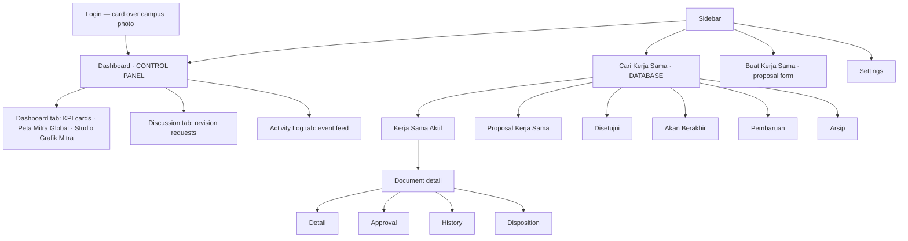

# Interface Design
## Partnership Document Management System

| | |
|---|---|
| **Version** | 3.0 — aligned to the SIM-KS UI mockups, schema v3.0, and PCU brand |
| **Companion documents** | Master PRD v2.2 · Schema v3.0 (`.mwb`-aligned) · Architecture · Rules · SIM-KS UI mockups · PCU Brand Guidelines |
| **Scope** | Screen structure, interaction patterns, visual language. The SIM-KS mockups define the concrete layouts; this doc states the rules behind them and reconciles them with the brand. Colors/type follow PRD §16 (PCU Brand). |

---

## 1. Design direction

An internal administrative system for three audiences with very different needs:

- **IO staff** — daily, high-volume, need density and speed. They live here.
- **Occasional PCU users** — approvers logging in for two minutes; faculty submitting a few times a year; executives glancing at a dashboard. They should need no training.
- **External partners** — non-PCU users, filling one form once, possibly on a phone in another country. The single simplest, most self-explanatory surface in the system.

Serve them with **different screens**, not one compromise. The one thing every user should always know without hunting: **what state a document is in, and who it's waiting on.**

**Aesthetic: quiet institutional.** Typography carries hierarchy; color is functional only (status, urgency); flat surfaces, hairline borders; no decoration. This is a system of record for legal documents — it should read as careful administrative infrastructure, not a consumer product. Keeping it plain also keeps stakeholder feedback on the process rather than the palette.

---

## 2. Design tokens

### 2.1 Color — functional only

| Token | Meaning |
|---|---|
| `--surface` / `--surface-raised` / `--border` | Backgrounds and hairlines |
| `--text-primary` / `--text-secondary` / `--text-muted` | Text hierarchy (muted never load-bearing) |
| `--status-draft` | Draft — gray, inert |
| `--status-progress` | Submitted / In Disposition — blue |
| `--status-pending` | **Pending (frozen)** — a distinct, arresting color (e.g. deep amber-brown), because a frozen document is an exceptional state that IO must notice |
| `--status-approved` | Approved, awaiting signing — teal |
| `--status-active` | Active — green |
| `--status-archived` | Archived — gray, distinguished by label not hue |
| `--renewal-request` | Renewal-request disposition — violet, never confused with approval blue |
| `--sla-yellow` / `--sla-red` | Over 2 / over 4 (approval); 60 / 90 days (renewal) |
| `--action-danger` | Reject, terminate, merge — red, reserved for irreversible actions |
| `--eval-gap` scale | Diverging, colorblind-safe, for expectation-vs-satisfaction analytics |

**Rules:** every status pill and SLA flag carries a **text label** — color is never the only signal. Red is reserved for SLA-red and irreversible actions, so its appearance always means "stop and look." Pending gets its own strong color because it is rare and consequential.

### 2.2 Typography & spacing
Two weights (regular, medium); monospace for document numbers (they're identifiers, and monospace makes transcription errors visible). 8px spacing scale (8/16/24/32/48). Forms ~800px; lists wider (~1400px). Table rows comfortable (48px) with an opt-in compact mode (36px) for IO. Flat by default; elevation only for dropdowns, modals, the notification panel.

---

## 3. Information architecture

The SIM-KS mockups use **one flat sidebar** shared across roles — *Dashboard · Cari Kerja Sama · Buat Kerja Sama · Settings* — with a persistent PCU-logo header, a global menu (☰), and an account menu. Role differences are handled by **which tabs, actions, and rows appear**, not by different menus. (This is a change from my earlier role-shaped-menu proposal; the mockup's flat nav wins.) The per-role *visibility* principle still holds underneath: an approver only sees the documents dispositioned to them, a viewer sees no edit actions, etc.



**Role-conditioned visibility** (same nav, different affordances):

| Role | Sees / can do |
|---|---|
| IO Staff / Admin | Everything; Admin gets Settings + Studio chart config + master data |
| Approver | The documents dispositioned to their position; their approve/reject/pending/revision actions on the Approval tab |
| Faculty / UA-UP | Own submissions + the Active list; Buat Kerja Sama; renewal tasks dispositioned to their unit; SLA flags on their own submissions |
| Viewer | Dashboard + Active list, read-only |
| External partner | *No app shell — a single token page (§5.10)* |

---

## 4. Core patterns

### 4.1 Status pill
On every document, everywhere. Colored dot + text label. Archived pills always carry the reason as a second segment ("Diarsipkan · Kedaluwarsa"). **Pending pills use the distinct frozen color** and read "Ditangguhkan" so a frozen document is unmistakable in any list.

### 4.2 SLA flag — asymmetric visibility
Flag indicator + elapsed count. On the **approval** scale it shows business days (yellow >2, red >4); on the **renewal-request** scale it shows days toward 30/60/90.

| Audience | Sees |
|---|---|
| The approver themselves | Their own flag on their own pending item |
| **Faculty submitter** | **Flags on their own submissions** (resolved D2) |
| IO | All flags on all documents |
| Other approvers on the same document | Nothing |

A frozen (Pending) document shows **no accruing flag** — the clock is stopped, and the UI should show a paused indicator rather than a ticking one, or IO will misread a frozen document as an overdue one.

### 4.3 Tier progress indicator
The component that carries the most explanatory weight, on the Approval tab. Shows the three tiers, each approver's state, and — resolved D1 — **the position plus the current holder's name** where one exists ("Wakil Rektor Akademik — Dr. Eddy"), falling back to position-only for a vacant role, because IO's job is chasing and a name is more actionable.

```
TIER 1  ✓ Head of IO — [name]                 Disetujui 08 Sep
        ● Ka. Bag. Sekretariat Rektorat        Menunggu · ▲ 3 hari kerja
TIER 2  ○ Dekan FTI — [name]                   Belum dibuka
TIER 3  ○ Wakil Rektor + Rektor                Belum dibuka
```

Glyphs: `✓` approved · `●` awaiting action · `○` locked (tier not reached) · `✕` rejected. Empty tiers are **omitted**, not shown blank. Because tier 3 now holds WR **and** Rektor in parallel, it renders as two peers within one tier, not two stacked tiers.

### 4.4 Pending vs Revision — two visibly different actions
The approver action panel offers four choices, and the UI must make Pending and Revision feel as different as they are:

| Action | Presentation |
|---|---|
| **Setujui** (Approve) | Primary |
| **Tolak** (Reject) | Danger — with a confirmation stating it archives the document and requires starting over, and offering *Minta Revisi* as the softer alternative right there |
| **Tangguhkan** (Pending) | A heavyweight action, visually weightier and confirmed: "This freezes the document and stops the clock. When IO reactivates it, **the entire approval restarts from Tier 1.**" People must understand the blast radius before choosing it |
| **Minta Revisi** (Revision) | A lightweight action: request a change with a comment; the document stays where it is |

The confirmation copy is doing real work here — Pending's full-reset consequence is surprising, and a user who expected a gentle pause will be angry when everyone has to re-approve. Say it plainly at the moment of choice.

### 4.5 Tables & per-column filters
Every list view. Sortable columns, server-side pagination, persistent filter state. **Every field gets a column filter control** (resolved this cycle) — filter the on-screen list, then export the filtered view. Status/archive is one of those filters, defaulting to the list's natural scope; there is no global archive toggle. The three dedicated exports (active / per-document SLA / ongoing+processed) each carry the full filter set. The export button sits with the filters, so it visibly exports "what I'm looking at."

### 4.6 Forms & the Lingkup cascade
Single-column forms, labels above inputs, `(*)` for required, draft autosave. Section I loses **Fax and Year Established**. Country is a **dropdown** (it drives the KPI).

The **Lingkup Kerja Sama** selector (Section III) is a tree with tri-state checkboxes:

- Checking a **Faculty** auto-checks **all descendants** (Prodi and Programs), recursively.
- Unchecking one child puts the parent into an **indeterminate** state (a dash, not a check) — not fully selected, not empty.
- "Select all UA" / "Select all UP" shortcuts at the top.

Tri-state is the specific requirement: build an indeterminate visual state, not a binary checkbox that snaps the whole faculty off when one child is unchecked.

### 4.7 Live disposition editing
On the Approval tab, while the document is **in-disposition**, IO can **add** an approver to the current tier or **remove** a pending one. Approved approvers show no remove control (they can't be removed). The UI should make clear that adding makes the current tier wait for one more, and that removing the last outstanding approver will advance the document — a small inline note prevents surprise.

### 4.8 Destructive confirmations
Reject, early termination, partner merge, and now **Pending** (for its reset consequence) each get a plain-language confirmation stating what will happen — never a generic "Are you sure?".

---

## 5. Key screens

### 5.0 Concrete screens (from the SIM-KS mockups)
The mockups are the reference layouts; the subsections below give the rules behind them. The set:

| Screen | What the mockup shows |
|---|---|
| **Login** | A white rounded card centered over a full-bleed campus photo — the one place the brand's photographic/hero treatment appears. Carries the PCU logo. |
| **App shell** | Left sidebar (Midnight) with PCU logo + "SIM KERJA SAMA", account block, menu (Dashboard · Cari Kerja Sama · Buat Kerja Sama · Settings); top bar with ☰ and account icon. |
| **Dashboard · Dashboard tab** | KPI cards row; **Peta Mitra Global** (world map, Intl/Domestik toggle, region tabs); **Studio Grafik Mitra** (add up to 5 charts, per-chart type + grouping + Filter Data, Ekspor PDF). Academic-year selector. |
| **Dashboard · Discussion tab** | Table of revision requests: No Disposisi · Jenis · Nama Mitra · Pengirim Revisi · Penerima Revisi · Revisi · action. |
| **Dashboard · Activity Log tab** | Event feed: No · Jenis · Nama Mitra · Waktu · Kegiatan · action. |
| **Cari Kerja Sama (DATABASE)** | Six tabs — Kerja Sama Aktif · Proposal Kerja Sama · Disetujui · Akan Berakhir · Pembaruan · Arsip — each a paginated, searchable, per-column-filterable table with Unduh Laporan. Columns vary per tab (e.g. Akan Berakhir adds **Countdown**; Pembaruan adds an **Evaluasi** link; Proposal shows **Status** incl. "Disposisi - Tier N", "Pending", "Diproses"). |
| **Document detail** | Header (title, status badge e.g. "Dalam Disposisi", Unduh Dokumen); tabs **Detail · Approval · History · Disposition**; Informasi Mitra, Kerjasama yang Diusulkan (Hak/Kewajiban for MoA), Lingkup chips, Unit Pengusul, embedded document preview; "Tolak Pengajuan". |
| **Buat Kerja Sama (proposal form)** | Three grouped panels (Data Calon Mitra · Unit Pengusul · Kerja Sama yang Diusulkan), Agenda checkboxes, Bidang, Tujuan/Manfaat dropdowns, period, **Lingkup Kerja Sama recursive tri-state tree** with Unit Akademik/Pendukung toggles and search, Upload Draft; actions **Draft · Ajukan · Cancel**. |
| **Settings** | Master data + configuration (see §5.12). |

All of the above are feasible against schema v3.0 (see Schema §8); the only new data dependency is partner coordinates for the map.

### 5.1 Dashboard
KPI cards (Active · Expiring Soon · In Process · Stuck past SLA — the last for IO). **My Approvals** widget shown only when the user has pending items. Charts (IO-configured, read-only for others). Compact active list. **Evaluation analytics** section with the expectation-vs-satisfaction gap, clickable down to the partnerships behind any figure (drill-down).

### 5.2 My Approvals
An approver's landing queue, ordered red → yellow → rest. Each row opens the document on the **Approval tab**, not View. Empty state is a plain calm sentence.

### 5.3 My Renewal Tasks (units)
The queue of renewal requests dispositioned to a unit. Each row shows the expiring document, its renewal-request SLA (30/60/90 scale, violet), and the evaluation status pair (faculty / partner). The next action is on the row: fill the faculty evaluation, send/resend the partner link, or (once the gate opens) upload the renewal draft.

### 5.4 Document detail
Tabs: **View · Approval · History · Update/Revision Log**. Persistent header (document number monospace · title · status pill · type · partner(s) · dates when active). Approval tab leads with the tier progress indicator, then the action panel if the current user has one. The log tab shows both field edits and every revision event.

### 5.5 Proposal form
Three collapsible sections. Section I: partner autofill + inline create, **no Fax/Year Established**, country dropdown. Section III: the Lingkup cascade (§4.6). Multi-partner reveals repeatable Section I panels (rare, so it can be a secondary path). Two actions: *Simpan sebagai Draft* · *Ajukan*.

### 5.6 Disposition assignment
Position picker grouped by the **three** tiers, with counts and explicit "Tier X dilewati" when empty. A projected sequence preview. This screen is also where live add/remove happens once approval is underway (§4.7).

### 5.7 Activation form
Grouped: identity (number, dates, signing date) · signatories (add/remove for multi-partner) · PICs · executing units · references (Folder KUI, Dikti) · signed file. Auto-renewed documents hide the End Date field with an inline note.

### 5.8 Renewals (IO)
Timeline by expiry month (clustering is the insight). Each row shows renewal state via the status pair and the renewal SLA, with the next action inline. Completed renewal chains link predecessor ↔ successor both ways.

### 5.9 Faculty evaluation (in-system)
Section 1 read-only (prefilled). Two Likert grids (expectation, satisfaction — visually distinct so they're not conflated), five dimensions each. Recommendation (continue/terminate) prominent. Conditional follow-up (continuation detail or feedback). Respondent block prefilled "Dekan/Ka. UP." One submit, then locks. **SWOT is gone.**

### 5.10 Partner evaluation — public token page
The only non-PCU screen: no shell, no nav, no login. Priorities in order — **clarity, trust, low friction.**

- Short PCU-branded header establishing legitimacy (a bare form link must read as genuinely from Petra, not phishing).
- Section 1 read-only, prefilled — the partner sees their own institution named, confirming the link is about them.
- Same two Likert grids and recommendation as the faculty form, identical scale (so answers are comparable).
- Respondent name + email **required** — the accountability record for a no-login form.
- **Bilingual (ID/EN)** — international partners won't all read Indonesian.
- **Mobile-first** — this form more than any other is filled on a phone.
- One submit → confirmation → lock. Returning after submitting shows "already submitted," not the form — unless IO reopened it.

### 5.11 Split-decision review (IO/Head)
Both evaluations side by side — the two Likert grids adjacent so the disagreement is legible — both recommendations, both narratives. A single decision control: **Lanjutkan** or **Hentikan**, with a **required reason**. A secondary action: reopen the partner link if the resolution is "they should re-answer."

### 5.12 Admin
Partners (with merge — show affected document count before confirming). Positions & tiers (grouped by the three tiers). **Units & hierarchy** (the new parent-child data — a tree editor, since the cascade depends on it being correct). Country list. Managed lists (with usage counts for cleanup). Charts. Settings (thresholds, cadence, expiring-soon window).

---

## 6. States
Loading (skeletons), empty-exists, empty-filtered (distinct message — users mistake a filtered-empty list for a broken system), error. The public partner page adds **already-submitted** and **link-reopened**.

---

## 7. Notifications
In-app (bell, grouped by document, opens the relevant tab) + email (plain, text-first, one link). New triggers: **pending (frozen)**, **revision requested**, renewal-request SLA (30/60/90), evaluation submitted, split-decision flag. SLA reminder emails to a late approver stay factual and short; escalation to IO is a separate message the approver doesn't see. The partner receives only their token link, from the unit.

---

## 8. Responsive
Desktop-first for IO screens. **The partner token page is mobile-first and must be excellent on a phone.** Approval actions (My Approvals, document detail, approve/pending/revision/reject) remain mobile-usable so approvers can act from a reminder email. IO-heavy screens degrade to scroll/stack below 768px.

---

## 9. Accessibility
Contrast 4.5:1 text / 3:1 UI; every status and flag has a text label (color independence); full keyboard operation with visible focus; semantic tables and headings. The **Likert matrices** need particular care — each rating a keyboard- and screen-reader-reachable radio group per dimension, not a mouse-only grid — and the public partner page meets the same standard despite having no app shell. Tri-state Lingkup checkboxes must announce their indeterminate state.

---

## 10. Open design questions

| # | Question | Blocks |
|---|---|---|
| D5 | Partner page: how much PCU branding establishes trust without looking like a phishing target? | §5.10 |
| D6 | Split-decision review: overlay the two Likert grids, or show adjacent? | §5.11 |
| D7 | Evaluation analytics drill-down depth — to the document, or also to the individual response? | §5.1 |
| D8 | Units & hierarchy admin: full tree editor, or import-only with read-only display until the data stabilizes? | §5.12 |
