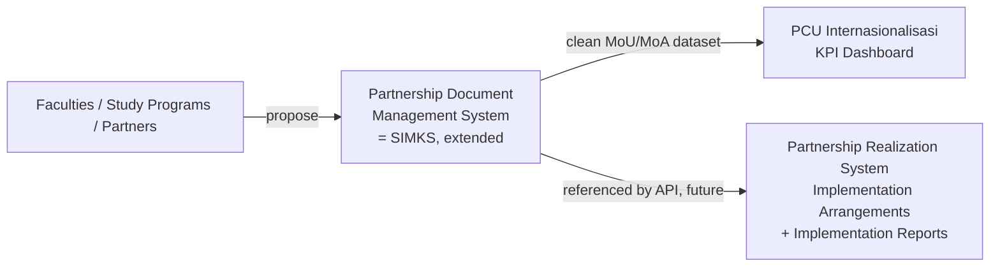
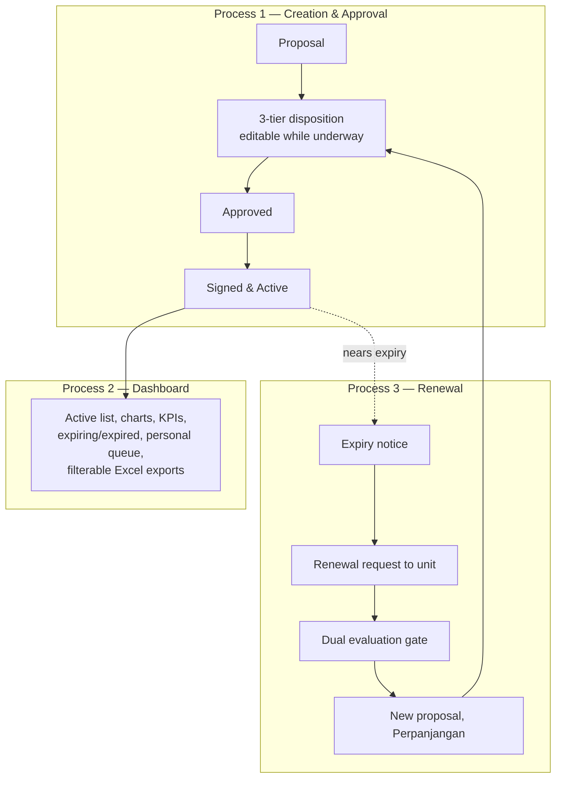
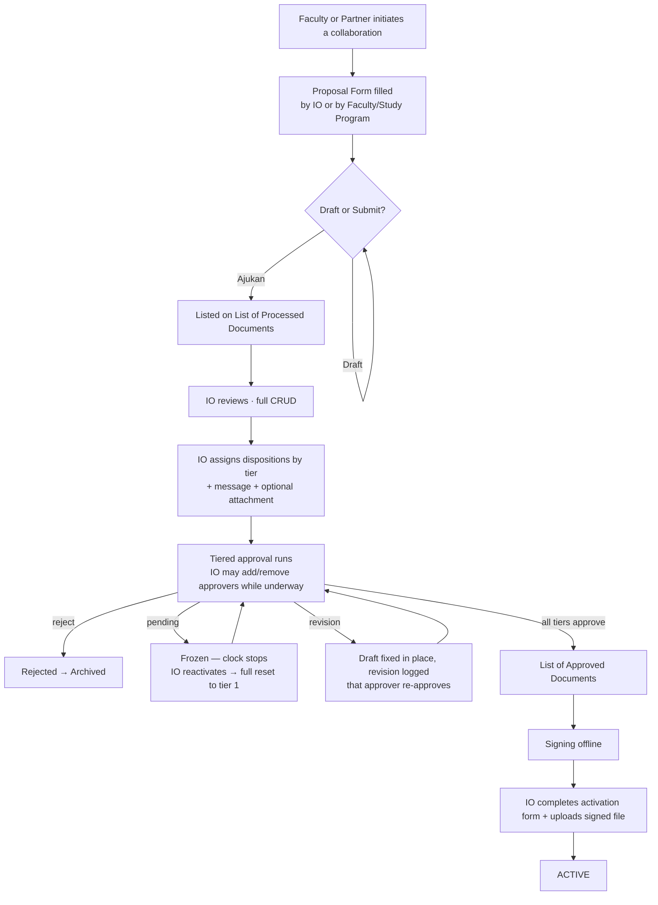
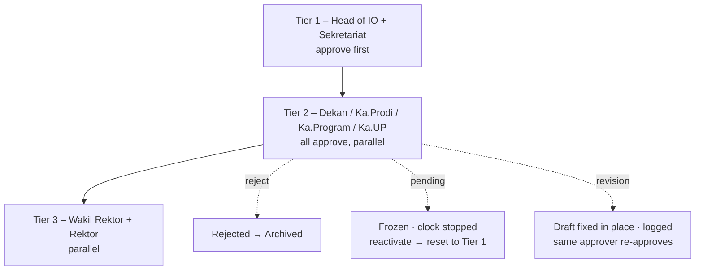
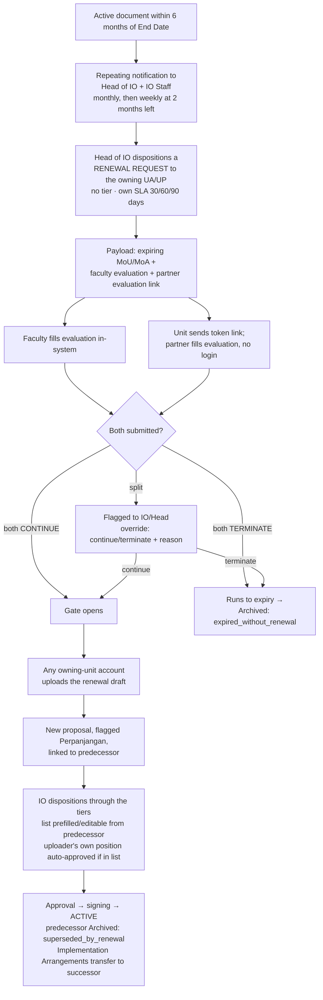
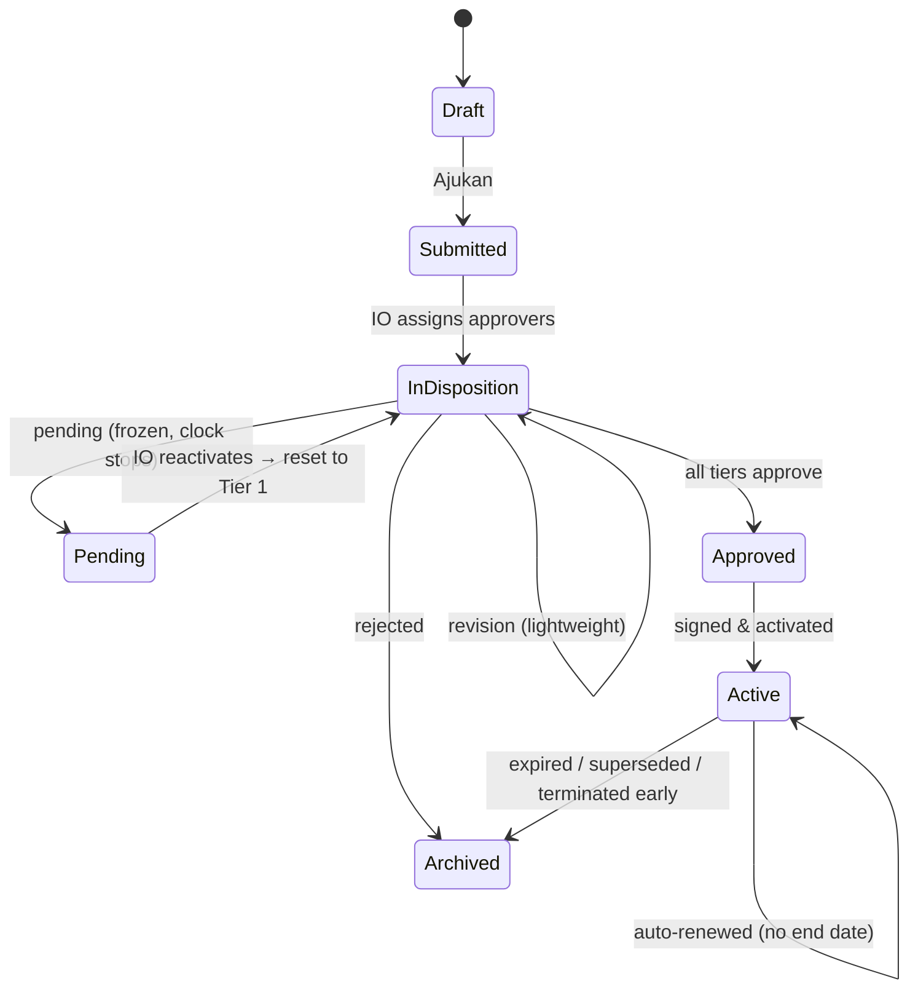

# Partnership Document Management System
## Comprehensive Product Requirements Document

| | |
|---|---|
| **System** | Partnership Document Management System (an extension of SIMKS) |
| **Owner** | International Office (Kantor Kerja Sama dan Urusan Internasional / KUI), Petra Christian University |
| **Audience** | PCU programmer team, IO stakeholders |
| **Status** | Master PRD v2.2 — consolidates the full brainstorm to date; now anchored to the concrete `database-sim-ks-2.mwb` model (schema v3.0) and the SIM-KS UI mockups |
| **Companion documents** | Schema v3.0 (`.mwb`-aligned) · Architecture · Design · Rules · `database-sim-ks-2.mwb` · SIM-KS UI mockups · PCU Brand Guidelines (2026 draft) |

---

## Table of contents

1. Executive summary
2. Background & strategic context
3. Goals & success metrics
4. Users & personas
5. System overview
6. Core concepts & vocabulary
7. Process 1 — Document creation & approval
8. Process 2 — Dashboard & reporting
9. Process 3 — Renewal (Pembaruan / Perpanjangan)
10. Document lifecycle & archival
11. Master data management
12. Access control & roles
13. SLA, reminders & notifications
14. Data model overview
15. Integration & downstream systems
16. Visual identity & brand
17. Non-functional requirements
18. Release plan & migration
19. Risks & mitigations
20. Resolved decisions & remaining questions
21. Glossary

---

## 1. Executive summary

The International Office manages the entire life of PCU's partnership documents — Memoranda of Understanding (MoU) and Agreement (MoA), and their amendments — from the moment a faculty or partner proposes a collaboration, through multi-level institutional approval, offline signing, activation, and eventual renewal or expiry.

Today this runs on **SIMKS** (io.petra.ac.id), which handles the basic proposal-and-approval path but leaves the hard parts unmanaged: the approval hierarchy isn't enforced, there's no graceful way to request a change short of rejecting outright, nobody can see where a document is stuck, process speed isn't measured, renewal is manual and disconnected from the units that own the relationships, and the underlying data is too inconsistent to build anything on.

This project **extends SIMKS in place** to fix those gaps and turn it into the authoritative system of record for every PCU partnership. It does three things:

1. **Creates and approves** partnership documents through an enforced **three-tier** disposition process with a lightweight revision path, a heavyweight pending/reset path, an outright reject, and full audit history — with the ability for IO to edit the approver list even while approval is underway.
2. **Surfaces and measures** everything through a dashboard — active partnerships, expiries, approval bottlenecks, the team's KPIs, and structured evaluation analytics — with per-column-filterable Excel exports.
3. **Renews** partnerships proactively, driven by structured evaluations collected from both the owning faculty and the external partner before any renewal proceeds.

Crucially, the system is **infrastructure**: its clean partnership dataset feeds the existing PCU Internasionalisasi (KPI) Dashboard, and will be the referenced source for a future **Partnership Realization System** in which faculties log Implementation Arrangements against these MoUs and MoAs.

---

## 2. Background & strategic context

### 2.1 The current system
SIMKS is the live partnership platform at io.petra.ac.id. Evidence from the running system (encrypted Laravel-style URLs, server-rendered pages, DataTables-style lists) indicates a **Laravel/PHP application on a MySQL-family database** — to be confirmed by the programmer team as the first step. It already holds ~2,289+ agreements plus master lists of ~379 organizational units, ~41 institutional positions, and ~64 cooperation-agenda types.

### 2.2 Why extend rather than rebuild
The mandate is explicit: **evolve SIMKS on top of its existing codebase and database, reusing its accounts and login.** Not a rewrite, not a parallel system. The first deliverable is therefore a **reconciliation audit** mapping every entity in this specification to what already exists in SIMKS.

### 2.3 Where this system sits

Permanent archival, enforced renewal linkage, partner-record merging, and structured evaluation data exist because two other systems depend on this one being a stable source of truth.

---

## 3. Goals & success metrics

### 3.1 Goals

| # | Goal |
|---|---|
| G1 | Enforce the institutional approval hierarchy in software |
| G2 | Give approvers graceful alternatives to outright rejection |
| G3 | Make approval delays visible and self-correcting |
| G4 | Measure document turnaround time systematically |
| G5 | Make renewal proactive, unit-driven, and evidence-based |
| G6 | Produce a clean, stable, referenceable partnership dataset |
| G7 | Give all stakeholders visibility into active partnerships |
| G8 | Capture structured partnership-evaluation data for institutional insight |
| G9 | Present as an official PCU property — correct brand identity throughout, and a trustworthy branded surface for external partners |

### 3.2 Team KPIs the system must produce

1. **Jumlah MoU dan MoA Dalam Negeri & Luar Negeri** — counts of MoU vs MoA, split domestic vs international. **Domestic/international is determined by the partner's country** (Indonesia = Dalam Negeri, otherwise Luar Negeri) — see §11 on why country is a controlled dropdown.
2. **Penyelesaian Proses Dokumen Kurang Dari 1 Bulan** — proportion completed within one month. **Measured from submission to final approval** (the last disposition approval), **excluding the offline signing gap**, since signing is outside the team's process control. Both boundaries are still captured; the KPI uses the earlier one.

### 3.3 Success metrics

| Metric | Baseline | Target |
|---|---|---|
| Documents completed under 1 month (submission → final approval) | Not measured | Measured and reported |
| MoU/MoA domestic vs international | Manual | On demand |
| Approvals exceeding 4 business days | Unknown | Visible; reduced |
| Renewals begun before expiry with completed evaluations | Unknown | The default path |
| Documents expiring with no renewal decision | Unknown | Reduced — surfaced 6 months ahead, escalating cadence |
| Duplicate partner records | Accumulating | Detectable and mergeable |
| Partnerships with structured evaluation data | None | Every renewal-eligible partnership |

### 3.4 Non-goals
Digital/electronic signature; automatic document-number generation; partner **accounts** (partners use a scoped token link only); document file version history (revisions replace in place, with a log entry per revision); contract drafting or legal tooling; and building the Realization System or its API within this scope.

---

## 4. Users & personas

### 4.1 IO Partnership Staff — primary
Runs the process day to day: receives documents, creates and corrects proposals, decides who must approve each one, **edits the approver list even mid-approval**, chases approvals, reactivates paused documents, handles offline signing paperwork, and activates documents. In renewal, receives repeating expiry notifications and works the process alongside the Head. Highest-frequency user.

### 4.2 Head of International Office (IO Head) — primary
The senior owner, sitting on **both authorization axes at once**: an **application role** with elevated powers, and an **approver position** in the tier hierarchy — now in **tier 1** (see §6.1). Responsibilities:

1. **Approves dispositions** — as a tier-1 approver position, on documents dispositioned to that position (per-document authority derived from an open disposition, not a blanket power).
2. **Approves renewals** — the same way, within a renewal proposal's tiers.
3. **Initiates the renewal disposition** — dispositions a renewal request to the owning unit when a document nears expiry; the entry point of the renewal flow.
4. **Resolves split-decision evaluations** — records the continue/terminate override with a required reason.
5. **Reopens partner evaluation links** — shared with IO Staff.
6. **Reactivates paused ("Pending") documents** — shared with IO Staff.
7. **Receives repeating expiry notifications** — alongside IO Staff.

Also does everything IO Staff can, and typically holds IO Admin — though those admin powers belong to that role (§4.3), kept separable.

### 4.3 IO Admin — application role
Elevated role, usually held by the Head and senior staff: dashboard chart configuration, master-data administration (partner merge, position/tier assignment, managed lists, **unit hierarchy**), and system settings.

### 4.4 Faculty / Study Program / Program Coordinator (UA/UP) — secondary
Originates partnerships and **owns the renewal relationship**. On renewal: receives the disposition, fills the faculty-side evaluation in-system, sends the partner their evaluation link, and uploads the renewal draft once both evaluations clear. Any account belonging to the unit can act. Sees SLA flags on its own submissions.

### 4.5 Disposition Approver — secondary
Rektor, Wakil Rektor, Dekan, Kepala Prodi/Program/UP, etc. Logs in only when a document needs approval. Uses a **role-based account** (`dekan-fti@petra.ac.id`), so it survives office-holder changes and pending approvals transfer automatically.

### 4.6 Executive / Institutional Viewer — tertiary
Read-only consumer of dashboard views and the active list.

### 4.7 External Partner — non-login participant
No account, no general access. On renewal only, receives a **token link** and fills the partner-side evaluation directly — prefilled, no login — confirming name and email. The page they land on carries full PCU branding (§16.5) so a bare link reads as unmistakably official rather than as phishing.

---

## 5. System overview

### 5.1 The three processes

### 5.2 The two ideas that shape everything

**a. Tiered, structured approval.** Approval is three ordered tiers where a higher tier cannot act until every lower tier has approved. Approvers have four actions — approve, reject (kills it), pending (freezes and, on reactivation, resets the whole approval), and revision (lightweight, fix-the-draft). IO can add or remove approvers while approval is underway.

**b. Two kinds of "disposition."** "Disposition" means two structurally different things: an **approval** (routed to a *position*, tiered, gates progress, ends on approval) and a **renewal request** (routed to a *unit*, no tier, doesn't gate, ends when the unit uploads a draft). Same table, never the same logic.

---

## 6. Core concepts & vocabulary

| Concept | Definition |
|---|---|
| **Document** | One proposal → one active partnership record. Type (MoU/MoA), status, dates, links |
| **Partner (Mitra)** | An organization PCU partners with. Master record, autofilled, mergeable |
| **Unit (UA/UP)** | A PCU organizational unit — now with a **parent-child hierarchy** (Faculty → Prodi → Program) |
| **Position (Jabatan)** | An institutional role (~41), each with an explicit approval **tier** (1–3) or none |
| **Disposition** | An assignment: an **approval** (to a position) or a **renewal request** (to a unit) |
| **Tier** | One of **three** ordered approval levels; higher tiers gated behind lower ones |
| **Evaluation** | A structured pre-renewal assessment, from the faculty and from the partner |
| **Agenda Kerjasama** | Cooperation type(s), from a ~64-item master (incl. "Adendum/Amandemen") |
| **Archive** | The permanent inactive state, always with a recorded reason |

### 6.1 The three approval tiers *(revised — was four)*

| Tier | Who | Rule |
|---|---|---|
| 1 | **Head of International Office + Kepala Bagian Sekretariat Rektorat** | Approve first — the gate. (IO now gates its own submissions.) |
| 2 | **Dekan, Kepala Program Studi, Kepala Program, Kepala UP** | Parallel — any order among those selected |
| 3 | **Wakil Rektor + Rektor** | Unlocks after all of tier 2 approves. WR and Rektor approve **in parallel** — Rektor is no longer a separate final step |

Rules programmers must not get wrong:
- **Tier is stored explicitly** per position, never inferred from its name (e.g. "Kepala Bagian Sekretariat Rektorat" is tier 1; every other "Kepala" is tier 2).
- **A tier unlocks when no un-approved disposition remains in any lower tier** — "no blockers below," not "the previous tier finished" — so empty tiers skip rather than deadlock.

---

## 7. Process 1 — Document creation & approval

### 7.1 Full flow

### 7.2 Submission

The **Proposal Form** has three sections:

- **Section I — Prospective Partner:** partner selection with autofill or inline creation. Fields: country (**controlled dropdown**, drives domestic/international), city, address, phone, affiliation, business network, business type, and a contact person. **Fax and Year Established are removed.** Includes a due-diligence sub-table (other Indonesian institutions already partnered with this partner) and a free-text Informasi Tambahan field.
- **Section II — Proposing/Executing Unit:** the unit (from the unit master) and its contact person.
- **Section III — Proposed Cooperation:** MoU vs MoA, agenda types, fields of cooperation, goals, benefits, period, period type (Kedua Belah Pihak / Auto Renewed). Includes **Lingkup Kerja Sama** (see §7.3).

Submission is two-step: *Simpan sebagai Draft* (private to creator + IO) or *Ajukan*. Both IO and Faculty/Study Program can submit into the same List of Processed Documents. Several fields (Tujuan Kerjasama, Manfaat bagi UKP, Manfaat bagi Mitra, new Jabatan values) are free-text-then-dropdown, publishing immediately with no moderation.

### 7.3 Lingkup Kerja Sama — cascading unit selection *(new)*

Section III's scope selector lists all UA and UP, with "select all UA" / "select all UP" options, and — new — a **hierarchical cascade**:

- Checking a **Faculty** automatically checks **all its descendants** — every Program Studi and every Program beneath it, at any depth.
- Example: checking *School of Business and Management* auto-checks Prodi Manajemen and Prodi Akuntansi, and every program beneath them (International Business Management, Hotel Management, Creative Tourism, …).
- The user can then **uncheck an individual child**, which puts the parent into a **partial/indeterminate** state (not fully checked, not empty).

This depends on the **unit master carrying parent-child relationships**, which it does not today — the hierarchy data is a new dependency being supplied. The cascade must be **recursive** (walk all descendant levels), not hardcoded to a fixed depth.

### 7.4 Disposition (assignment)

IO **handpicks** approving positions per document from the position master — routing is always manual. A disposition carries a message and an optional attached document. Approvers are grouped by tier; an empty tier is skipped.

### 7.5 Tiered approval

**Four approver actions:**

| Action | Weight | Effect |
|---|---|---|
| **Approve** | — | Records approval (optional comment); may unlock the next tier |
| **Reject (Tolak)** | Terminal | Hard stop → archived *rejected*; no resume; a new document is required |
| **Pending** | Heavyweight | Document enters a **frozen pending state** — the SLA **clock stops**. Only IO Head/Staff can reactivate it, and on reactivation **the entire approval resets to tier 1**, even tiers that had already approved |
| **Revision** | Lightweight | Requests a change to the draft; IO fixes the draft **in place** (no file versioning) and **every revision is logged** (time, actor, comment); that approver then approves the revised draft. Does not reset other tiers |

The distinction is deliberate: **Pending** is "something is fundamentally off — stop the clock, and when it's resolved we start over," while **Revision** is "fix this detail and continue." They are different actions with different blast radii.

Two logs run throughout: **Approval History** (actor, timestamp, action, comment) and **Update/Revision Log** (field-level changes and each revision event). No discussion thread.

### 7.6 Editing a disposition while underway *(new)*

IO can edit the approver list **while the document is `in_disposition`** (only — once fully approved and in signing, the list is frozen):

- **Add** an approver to the **current tier** → the tier now waits for the new approver before advancing.
- **Remove** a **pending** approver → allowed; if they were the last blocker, removal **immediately re-runs tier gating and unlocks the next tier**.
- **Remove** an **already-approved** approver → **not allowed**; their approval stands in the history.

Both add and remove trigger the same tier-gating re-evaluation — add can block advancement, remove can cause it. They are two entry points to one recompute.

### 7.7 Signing & activation

After all tiers approve, the document moves to the **List of Approved Documents**; signing is offline. IO then completes the activation form and uploads the signed file, capturing: **Document Number** (typed by IO, never generated), Start/End/Signing dates, signatories (UKP + partner, add/remove for multi-partner), partner and UKP PIC blocks, Unit Pelaksana (re-confirmed here), Folder KUI, No. Berkas Dikti, and the signed file. The document is then **Active**.

### 7.8 Multi-partner documents

A document may have more than one Calon Mitra; Section I repeats per partner while Section III stays shared. **"Manfaat bagi Calon Mitra" is a single shared statement**, not per-partner. Internally a many-to-many Document↔Partner relationship; a partner's history surfaces every document they're party to. Multi-partner is **rare**, so its build is scheduled into Phase 3.

---

## 8. Process 2 — Dashboard & reporting

> The SIM-KS UI mockups now define the concrete dashboard; this section states its requirements and data. The screens: a left sidebar (Dashboard · Cari Kerja Sama · Buat Kerja Sama · Settings) and a control panel with three tabs — **Dashboard · Discussion · Activity Log**.

### 8.1 Access & structure
Any logged-in user may view (not public). The Dashboard tab presents:
- **KPI summary cards** exactly as mocked: *Jumlah Kerja Sama Aktif* (active documents), *Jumlah Mitra Internasional* and *Jumlah Mitra Domestik* (partner counts — note these count **mitra**, from `partner.is_international`), *Dokumen Akan Kadaluarsa*, *Jumlah Dokumen Dalam Proses*, *Melewati SLA*, and *Penyelesaian Dokumen < 1 Bulan* (%).
- **Peta Mitra Global** — a world map of partner locations with an Internasional/Domestik toggle and region tabs (Semua/Asia/Eropa/Amerika/Australia). Requires partner **coordinates** (a new data need — see Schema §8; geocoded from city/country).
- **Studio Grafik Mitra** — a chart studio where **IO Admin** builds up to **5** saved charts (bar/horizontal-bar/donut/line/area/radar/treemap), each with grouping, metric, stack, ordering, max-categories, and a Filter Data set (Region · Status · Dokumen (MoU/MoA) · Fakultas). Others view read-only. Export to PDF.
- A per-academic-year selector (e.g. "2026/2027 - Ganjil").

The **Discussion** and **Activity Log** tabs are read-only views, not new data: Discussion lists revision requests (sender position, receiver, message — from the disposition/revision records); Activity Log is the event feed ("KUI mengirim Approval ke …", "Rektor me-respond Approve", "Proposal dibuat").

The database view (**Cari Kerja Sama**) presents the lifecycle as tabs — **Kerja Sama Aktif · Proposal Kerja Sama · Disetujui · Akan Berakhir · Pembaruan · Arsip** — each a filterable, paginated table with an "Unduh Laporan" export.

### 8.2 Status filtering, not a global toggle
Status — incl. archive state and reason — is a **filter on every list and chart**, defaulting to active. No global archive switch. In the UI this appears as the tabbed lists plus the Studio's Filter Data → Status control (Aktif · Kedaluarsa · Diarsipkan · Menunggu Perpanjangan · Draft).

### 8.3 Reporting the KPIs and process health
- **MoU/MoA domestic vs international** — from partner **country** / `is_international` (KPI 1).
- **Document turnaround** — submission → final approval, excluding signing (KPI 2). Both timestamps captured regardless.
- **Per-party approval duration** — average time each position takes, from SLA timestamps.
- **Disposition bottleneck view** — documents currently stuck past threshold, by tier.
- **Evaluation analytics with drill-down** — the renewal evaluations' Likert data drives an **expectation-vs-satisfaction gap** view across five dimensions, aggregated and filterable by unit, partner network, and period, and **clickable down to the specific partnerships** behind any figure. The analytics query must preserve each data point's link back to its document.
- The mocked Studio charts (e.g. "Jumlah MoU dan MoA Aktif" donut, "Partner per Negara" horizontal bar, "Fakultas dengan Dokumen" treemap) are examples of what the studio produces, not fixed reports.

### 8.4 Personal queue & exports
- **My Disposition/Approval** — a personal queue, as a dashboard widget and a standalone page.
- **Excel exports** — three dedicated exports, each with a **per-column filter control** (filter the on-screen list, export the filtered view):
  1. **Active documents**
  2. **SLA process per document** (the approval-time record for each document)
  3. **Ongoing and processed documents**
  Plus the per-list "Unduh Laporan" and the Studio's "Ekspor PDF".

---

## 9. Process 3 — Renewal (Pembaruan / Perpanjangan)

### 9.1 Full flow

### 9.2 The two kinds of disposition

| | Renewal request | Approval |
|---|---|---|
| Sent by | Head of IO | IO Staff / Head |
| Received by | The owning UA/UP (a unit) | A position from the master |
| Meaning | "Handle this renewal" — a task | "Approve this" — a gate |
| Tiers | None | Three, sequential |
| Gates progress? | No | Yes |
| Ends when | The unit uploads the renewal draft | The approver acts |
| SLA scale | Reminder 30d / yellow 60d / red 90d | Yellow >2 / red >4 business days |

Same table (a `kind` field), never the same logic — a renewal request never enters tier gating.

### 9.3 The evaluation

Two structured forms, one definition by respondent:
- **Faculty side** — filled in-system by any account of the owning unit.
- **Partner side** — filled via a **no-login token link** the unit emails; section 1 prefilled from the document; partner confirms name and email.

Content (adapted from PCU form F03-PM03-KUI-UKP, **SWOT removed**): two **Likert grids** (1–5) — **expectation** and **satisfaction** across Quality, Relevance, Productivity, Sustainability, Communication — a **recommendation** (continue / terminate), continuation detail or feedback, and respondent identity. **Structured data, never a file upload.** Each submission records the **form revision** it was filled against; old submissions keep their structure if the form changes.

On a **multi-partner** renewal, there is **one partner evaluation, for the lead partner** — not one per partner.

### 9.4 The gate and its four outcomes

The system **refuses to create the Perpanjangan proposal** until both evaluations are submitted and both recommend "continue."

| Faculty | Partner | Result |
|---|---|---|
| Continue | Continue | **Gate opens** — unit may upload the renewal draft |
| Terminate | Terminate | Runs to expiry → Archived *expired_without_renewal* |
| Continue | Terminate | **Split — flagged to IO/Head** |
| Terminate | Continue | **Split — flagged to IO/Head** |

A split raises a notification and is resolved by an explicit **override** — continue or terminate — with a **required reason**, audited.

### 9.5 Token link lifecycle
The token is the credential: long, unguessable, server-resolved, granting access to exactly one evaluation. **Valid until submitted, then locks.** **IO Head and Staff can reopen** it — superseding the locked submission (prior answer preserved in history) and issuing a fresh token — so a change of mind has a recorded path. Reopening is audited.

### 9.6 Draft upload and reuse of Process 1
Once the gate opens, **any account of the owning unit** uploads the renewal draft, creating a proposal flagged **Perpanjangan**, linked to the predecessor. On the disposition page the approver list is **prefilled (editable)** from the predecessor's approval history (empty for legacy documents with no history), and the **uploader's own position is auto-approved only if it appears in the prefilled list**. The renewal then follows the tiers, signing, and activation. When Active, the predecessor is archived *superseded_by_renewal* and any linked Implementation Arrangement transfers to the successor.

### 9.7 Auto-renewal and addendum
**Auto Renewed** documents have **no End Date**, stay Active indefinitely, and never enter the expiry-driven flow; evaluation is optional. Changes go through an **addendum** — a new proposal with agenda "Adendum/Amandemen," full tiered approval (a minor "revision" is handled the same way). **Expiry cadence:** monthly from 6 months out, escalating to **weekly once ≤2 months remain**, until a renewal request is dispositioned.

---

## 10. Document lifecycle & archival

**Archive reasons** (documents are never hard-deleted; going inactive always records a reason):

| Reason | Trigger |
|---|---|
| **Rejected** | An approver rejects during Process 1 |
| **Expired without renewal** | End Date reached with no completed renewal |
| **Superseded by renewal** | A Perpanjangan document went Active |
| **Terminated early** | IO marks an Active document inactive before its End Date (no extra approval) |

Archived documents remain permanently viewable — permanence is what lets the Realization System reference them safely.

---

## 11. Master data management

A single **Master Data admin area** (IO Admin) governs:

| Master list | Notes |
|---|---|
| **Partners** | Grow via inline creation; need a **merge** that re-points every referencing document; duplicate-suspicion flag assists, merge decision is manual |
| **Units (UA/UP)** | ~379, coded, academic/support — now also carrying a **parent-child hierarchy** (Faculty → Prodi → Program) for the Lingkup Kerja Sama cascade; hierarchy data is a new import |
| **Positions (Jabatan)** | ~41, each with an editable **approval tier** (now 1–3) |
| **Agenda types** | ~64; "Adendum/Amandemen" flagged so the addendum path is detected without string-matching |
| **Country** | A **controlled dropdown**, because it is the authoritative source for the domestic/international KPI — free text would fragment the KPI on spelling |
| **Growing dropdowns** | Tujuan Kerjasama, Manfaat bagi UKP/Mitra, new Jabatan values — publish immediately; the admin area provides cleanup (deactivate/merge) |

---

## 12. Access control & roles

### 12.1 Two authorization axes
- **What can this account do?** — a stored role: `submitter`, `io_staff`, `io_admin`, `viewer`.
- **Can this account approve this specific document?** — **derived**: is there an open disposition for this document matching the account's position? "Approver" is never a stored role. The IO Head sits on both axes (§4.2).

### 12.2 Visibility

| Who | Can see |
|---|---|
| Any logged-in user | **All Active documents, including files** — a deliberate IO decision |
| IO Staff / Admin | Everything |
| Faculty submitter | Own submissions (any status) + the Active list; **SLA flags on their own submissions** |
| Approver | Documents dispositioned to their position + the Active list |
| External partner | Exactly one evaluation, via token |

In-progress documents are restricted to IO and assigned approvers. Enforcement is server-side (scoped queries, not just hidden links); files are served through an authorization check.

### 12.3 Role-based accounts
Approver accounts map to **positions, not people** (`dekan-fti@petra.ac.id`); office-holder changes need no migration and notifications reach the current holder. The trade-off: the audit trail identifies positions, not individuals.

---

## 13. SLA, reminders & notifications

### 13.1 Two SLA scales, plus a pause concept

| Scale | Applies to | Reminder | Yellow | Red | Unit |
|---|---|---|---|---|---|
| **Approval** | Each approver on an approval disposition | — | > 2 | > 4 | business days |
| **Renewal request** | The owning unit on a renewal request | 30 | 60 | 90 | days |

Approval SLA is **per individual approver, never per tier**; the clock starts when that approver's **tier unlocks** (never at submission). A **new requirement from the Pending change:** the approval clock must **pause while a document is in the frozen Pending state and resume on reactivation** — so elapsed time now excludes weekends, holidays, *and* frozen periods. Business-day counting requires a **holiday calendar**. Yellow → reminder to the approver; red → second reminder plus escalation to IO.

### 13.2 Notifications
Email + in-app, to role-based accounts, on: disposition assigned, approved, **pending (frozen)**, **revision requested**, rejected, expiring soon (repeating cadence), approval SLA yellow/red, renewal-request SLA (30/60/90), evaluation submitted, and split-decision flag. The external partner receives only their token link, from the unit.

---

## 14. Data model overview

| Entity | Purpose | Key relationships |
|---|---|---|
| **Document** | Proposal → active partnership record | many-to-many Partner; one-to-many Disposition; self-link for renewal |
| **Document ↔ Partner** | Many-to-many join (used even for one partner) | — |
| **Partner** | Master org record, mergeable, country from dropdown | many documents |
| **Unit** | UA/UP master (~379) with **parent-child hierarchy** | proposing/scope/executing; renewal-request target |
| **Position** | Role master (~41) with **tier (1–3)** | approval dispositions |
| **Disposition** | An assignment; `kind` = approval or renewal_request; editable while in-disposition | to a position or a unit |
| **Evaluation** | Structured pre-renewal assessment, per respondent (partner side = lead only) | belongs to a document; accessed by token |
| **Partner eval token** | No-login access to one partner evaluation | belongs to an evaluation |
| **Renewal decision** | Records a split-decision override | belongs to a document |
| **Approval History / Revision Log** | Append-only workflow + revision logs | belong to a document |
| **Agenda / managed lists / country / settings / charts / holidays** | Supporting masters and config | — |

**Downstream contract:** each future Implementation Arrangement references exactly one **Active** MoU/MoA (one document → many arrangements); renewal transfers linkage to the successor, so an arrangement never points at an archived document.

---

## 15. Integration & downstream systems

- **PCU Internasionalisasi (KPI) Dashboard** — this system feeds it; the two keep separate role models but share the user/position identity.
- **Partnership Realization System (future)** — faculties, study programs, and coordinators will upload Implementation Arrangements and Reports; each arrangement references an Active MoU/MoA (one-to-many). A read **API** (list active MoU/MoA, fetch detail, resolve a renewal successor) will be needed — Phase 4, but the model here forecloses nothing.

---

---

## 16. Visual identity & brand

The system must present as an official Petra Christian University property, following the **PCU Brand Guidelines (2026 draft)**. This is not decoration: for the one screen an external partner sees (the evaluation token page, §9), correct branding is the primary trust signal that the link is genuinely from PCU and not a phishing attempt. Everywhere else it keeps the system unmistakably institutional.

### 16.1 Register — the "Formal" application of the brand

The brand defines three moods — Formal, Casual/Dynamic, and Bold. A system of record for legal partnership documents uses the **Formal** register throughout: dominant Midnight / Black / White / White Smoke, with the secondary palette used sparingly and only where it carries meaning (status, flags). The playful geometry, gradients, and bright secondary colors that suit marketing material are used minimally, and never inside dense data screens.

### 16.2 Color

Functional use of the brand palette — every color still carries one meaning and always pairs with a text label (never color alone):

| Role | Brand color | Hex |
|---|---|---|
| Primary brand / headers / nav | Midnight | `#19304b` |
| Text | Black | `#000000` |
| Page background | White / White Smoke | `#ffffff` / `#f1f1f1` |
| Interactive / primary action | Blue | `#3880d0` |
| Status — In Disposition / Submitted | Blue | `#3880d0` |
| Status — Pending (frozen) | Vivid Orange | `#f37121` |
| Status — Approved (awaiting signing) | Light Sea Green | `#45b8bc` |
| Status — Active | Green | `#6aaa43` |
| Status — Draft / Archived | grays (White Smoke → mid) | `#f1f1f1` … |
| Renewal-request disposition | Soft Purple | `#BE93E4` |
| SLA yellow | Selective Yellow | `#ffbc00` |
| SLA red / destructive actions | Vivid Red | `#e31f26` |
| Evaluation-gap analytics (diverging) | Hollywood Cerise ↔ Light Sea Green | `#ec008c` … `#45b8bc` |

Low-luminance brand colors (Selective Yellow, brand Yellow) are used as accent dots or fills behind dark text, never as text on white, so contrast stays legible.

### 16.3 Typography

- **Inter is the app typeface**, which is doubly correct: it is the brand's **primary** typeface *and* the brand's mandated **body-text** font. UI text, labels, tables, and headings all use Inter.
- Document numbers use a monospace face — a deliberate functional exception (identifiers, transcription-error visibility) the brand doesn't otherwise cover.
- The brand's headline/display faces (Bebas Neue, DIN Condensed, Baskerville, Helvetica Neue, Prestige Signature Script) are **for marketing materials, not a dense administrative UI**. They appear in the system only inside any generated formal/branded artifacts (§16.5), not in the screen chrome.

### 16.4 Logo & brand assets

- The official PCU logo (logomaster / wordmark) appears in the app header and on the login screen, on a Midnight or White background, with the brand's clear-space rule, and is **never modified** (no cropping, rotation, mirroring, recoloring, shadowing, or distortion — per the guidelines' prohibited-use list).
- Department/faculty co-branding (logo + unit name) follows the brand's Logo Department pattern where a unit context is shown.
- The recurring PCU arc/"U" motif may be used sparingly on entry and low-density surfaces (login, empty states, the partner page header) but not in data-dense screens, consistent with the Formal register.

### 16.5 The external-partner page (trust signal)

The public evaluation page (§9.5, Design §5.10) carries the **Full University Wordmark** ("PETRA CHRISTIAN UNIVERSITY" beside the logogram) on a Midnight header, so a partner opening a bare link immediately recognizes an official PCU page. It is bilingual (ID/EN). **This resolves the earlier open question about how much branding the partner page needs** — the answer is the official full wordmark on the brand's primary Midnight, nothing less.

### 16.6 Voice in copy

The brand's Personality Traits and voice/tone (Conversational, Relaxed & Easy Going, Colleagues & Friends, Politely Opinionated) are scoped by the guidelines to **marketing communication**. Internal admin microcopy stays primarily clear and functional, but may lean on the Down-to-Earth / Friendly-Direct / Respect traits for tone in notifications, empty states, and especially partner-facing emails — without becoming marketing copy.

### 16.7 Generated documents

Any formal artifact the system produces or templates (e.g. exported reports, certificate/letterhead-style outputs) follows the brand's Media Application rules — correct logo variant per medium, the fuller type system where appropriate, and the Formal color register.

> **Note on the source:** the guidelines are a 2026 **draft**. Confirm final hex values, approved logo files, and any changes with the Marketing and Relations Department (MRD) / University Communications (`branding@petra.ac.id`) before locking design tokens.

---

## 17. Non-functional requirements

| Area | Requirement |
|---|---|
| **Authentication** | Reuses SIMKS auth; accounts role-based, not personal |
| **Authorization** | Server-side on every action and file download; queries scoped |
| **Scheduler** | A cron/scheduler is **required** for SLA sweeps, expiry sweeps, and reminders — confirm the SIMKS host provides one |
| **SLA pause** | The approval clock must support pause/resume (frozen Pending periods), not just weekend/holiday exclusion |
| **Auditability** | Approval History and Revision Log are append-only; audit identifies positions, not individuals |
| **Data retention** | Documents never hard-deleted; archival is a status |
| **Data integrity** | Partner merges never orphan references; renewal linkage atomic; multi-step ops single-transaction; disposition edits re-run tier gating |
| **Performance** | List views usable at 2,000+ documents with per-column filters, joins, and export |
| **Public surface** | The partner token page is the only unauthenticated surface — tightly scoped, long random tokens, no document internals exposed |
| **Localization** | Bahasa Indonesia interface; the partner evaluation page bilingual (ID/EN) |
| **Brand identity** | Follows the PCU Brand Guidelines (§16) — Formal register, Inter typeface, unmodified official logo, Midnight-based palette; the external-partner page carries the full wordmark as a trust signal |
| **Compatibility** | Extends SIMKS in place; must not disrupt in-flight documents |
| **Extensibility** | The document dataset must be API-exposable later without schema rework |

---

## 18. Release plan & migration

| Phase | Delivers |
|---|---|
| **0 — Audit** | Reconciliation map against the live SIMKS schema; confirm the scheduler; confirm/import the unit hierarchy data; establish the **brand foundation** — confirm final brand colors/logo files with MRD, set design tokens from the PCU palette (§16), source approved logo assets |
| **1 — Core workflow** | Proposal (draft/submit, revised Section I, Lingkup cascade), lists, **three-tier** disposition with enforcement, the four approver actions (approve/reject/pending-reset/revision-logged), **live disposition editing**, approval + revision logs, activation, archive states & reasons, notifications |
| **2 — Visibility & measurement** | Approval SLA **with pause/resume**, flags, reminders, escalation, dashboard with active list + both KPIs, personal queue, the three filterable Excel exports |
| **3 — Lifecycle & renewal** | Renewal-request disposition kind, dual evaluation (faculty + partner token page), four-outcome gate, split-decision override, reopenable links, prefilled disposition with uploader auto-approve, evaluation analytics with drill-down, master-data admin with partner merge, configurable charts, **multi-partner support** |
| **4 — Downstream** | Read API for the Realization System (separate effort) |

**Pre-launch data prerequisites:** every position's **tier** populated; every approver position's **role-based email** populated; the **holiday calendar** seeded; the **unit parent-child hierarchy** imported (the Lingkup cascade depends on it); the **country dropdown** list seeded; **approved PCU logo assets and confirmed brand tokens** in place (§16), since the login screen and the partner page ship in Phases 1 and 3 respectively.

**Migration of in-flight documents:** documents mid-approval at rollout are **migrated into the new structure where they map cleanly**, and any that don't map cleanly **finish under the existing rules** as a fallback. The programmer team defines "maps cleanly" per-case after the audit. Because the system extends SIMKS in place rather than switching over, there may be no single cutover moment — the new behavior begins applying to the same live data — which should be confirmed during the audit.

---

## 19. Risks & mitigations

| Risk | Impact | Mitigation |
|---|---|---|
| SIMKS harder to extend than expected once audited | Timeline slip | Audit is the first deliverable |
| No scheduler on the host | SLA, reminders, expiry sweeps impossible | Confirm early — hard prerequisite for Phase 2 |
| Unit hierarchy data incomplete or inconsistent | Lingkup cascade unreliable | Validate the imported hierarchy before Phase 1; recursive cascade tolerant of varying depth |
| SLA pause/resume implemented as simple elapsed time | Frozen documents accrue false SLA breaches | Explicit pause/resume in the SLA engine; test frozen-then-reactivated documents |
| Pending's full reset frustrates approvers who re-approve everything | Process friction | Deliberate design — Pending is the heavyweight action; Revision is the light one. Train IO on when to use which |
| Public token link guessable or leaked | Unauthorized evaluation submission | Long unguessable tokens, valid-until-submitted, name/email capture, audited reopen |
| Units sit on renewal requests past 90 days | No time for tier approval | Renewal-request SLA with escalation; repeating expiry cadence from 6 months out |
| Evaluations kept as file uploads | Analytics (G8) lost | Structured fields mandated; no file path on evaluations |
| Country entered inconsistently | KPI 1 fragments | Controlled dropdown |
| Full document visibility exposes sensitive terms | Institutional sensitivity | Deliberate IO decision; revisit if a partner requires confidentiality |
| Role-based shared accounts obscure who acted | Weaker individual audit | Accepted trade-off; audit identifies positions |

---

## 20. Resolved decisions & remaining questions

### 20.1 Resolved this cycle

| # | Decision |
|---|---|
| Tiers | Collapsed 4 → 3: Head of IO + Sekretariat (1), Dekan/Ka.Prodi/Ka.Program/Ka.UP (2), WR + Rektor (3, parallel) |
| Pending | Freezes the document, stops the clock; IO reactivation resets the whole approval to tier 1 |
| Revision | In-place (no file versioning), every revision logged |
| Disposition editing | Add to current tier / remove pending approver (unlocks if last blocker) / can't remove approved; only while in-disposition |
| Form | Fax + Year Established removed; Lingkup Kerja Sama recursive cascade with indeterminate state |
| Exports | Three filterable Excel exports; per-column filters, export the filtered view |
| Units key | `units` uses its natural `code` as primary key (no surrogate id); unit FKs elsewhere store the code |
| Brand | Adopt the PCU Brand Guidelines (§16) — Formal register, Inter, Midnight palette, unmodified logo |
| Q1 | "Manfaat bagi Mitra" shared across partners |
| Q2 | Turnaround KPI excludes the signing gap |
| Q3 | Expiry cadence monthly, then weekly at ≤2 months |
| Q4 | Multi-partner rare → Phase 3 |
| Q5 | Migrate in-flight where clean; old-rules fallback |
| Q6 | Country dropdown is the domestic/international source |
| Q7 | One evaluation for the lead partner on multi-partner renewals |
| Q8 | Evaluation analytics with drill-down |
| D1 | Tier indicator shows position + holder name (falls back to position) |
| D2 | Faculty see SLA flags on their own submissions |
| D5 | Partner-page branding: the full PCU wordmark on Midnight (§16.5) — resolved by the brand guidelines |
| Schema | The `database-sim-ks-2.mwb` model is the source of truth (schema v3.0), with two overrides: role-based accounts (not `pegawai`/NIP) and structured evaluation (not one text sheet). The earlier "units.code as PK" is reverted — the `.mwb` uses integer keys |
| Unit depth | Unit hierarchy is one self-referential table, arbitrary depth (Faculty → Prodi → Program), merging the `.mwb`'s `parent_unit` + `unit` |
| Renewal target | A renewal-request disposition targets the owning unit's **head jabatan** (targets stay position-based); any account of that unit may act on it |
| Discussion tab | Retained as a read-only **revision-requests view** (not a free chat) — consistent with the UI's Dashboard→Discussion tab |

### 20.2 Still open

| # | Question |
|---|---|
| O2 | Whether there is any true cutover moment, or the new behavior simply begins on the live SIMKS data (confirm during the audit) |
| O3 | Final brand values to confirm with MRD / University Communications — the guidelines are a 2026 draft (hex values, approved logo files) |
| O4 | Partner **coordinates** for the Peta Mitra Global map — source/geocoding approach (city/country lookup vs. manual entry) |
| O5 | Whether `jaringan_bisnis` / `jenis_bisnis` need to be queryable columns on `partner` or can stay free-text/managed-options |

---

## 21. Glossary

| Term | Meaning |
|---|---|
| **SIMKS** | The existing partnership system at io.petra.ac.id that this project extends |
| **KUI / IO** | Kantor Kerja Sama dan Urusan Internasional — the International Office |
| **MoU / MoA** | Memorandum of Understanding / Agreement |
| **Disposisi (Disposition)** | Routing a document — for approval (to a position) or as a renewal task (to a unit) |
| **Tier** | One of three ordered approval levels |
| **Pending** | Heavyweight freeze; on reactivation, resets the whole approval |
| **Revision** | Lightweight in-place draft fix, logged per revision |
| **Perpanjangan / Pembaruan** | Renewal of an expiring partnership |
| **Adendum / Amandemen** | An amendment, submitted as a new proposal |
| **Kedua Belah Pihak** | A period type requiring both parties to agree to renew |
| **Auto Renewed** | A partnership that renews automatically and has no End Date |
| **UA / UP** | Unit Akademik / Unit Pembantu |
| **Jabatan** | An institutional position/role |
| **Lingkup Kerja Sama** | The units a partnership affects — now a cascading Faculty→Prodi→Program selection |
| **Unit Pelaksana** | Units executing a partnership, confirmed at signing |
| **Evaluation (faculty/partner)** | Structured pre-renewal assessment; faculty in-system, partner via token link |
| **Token link** | No-login URL letting an external partner fill their evaluation |
| **Split decision** | Faculty and partner disagree on renewing; resolved by IO/Head override |
| **Implementation Arrangement** | A concrete activity under an MoU/MoA, handled by the future Realization System |
