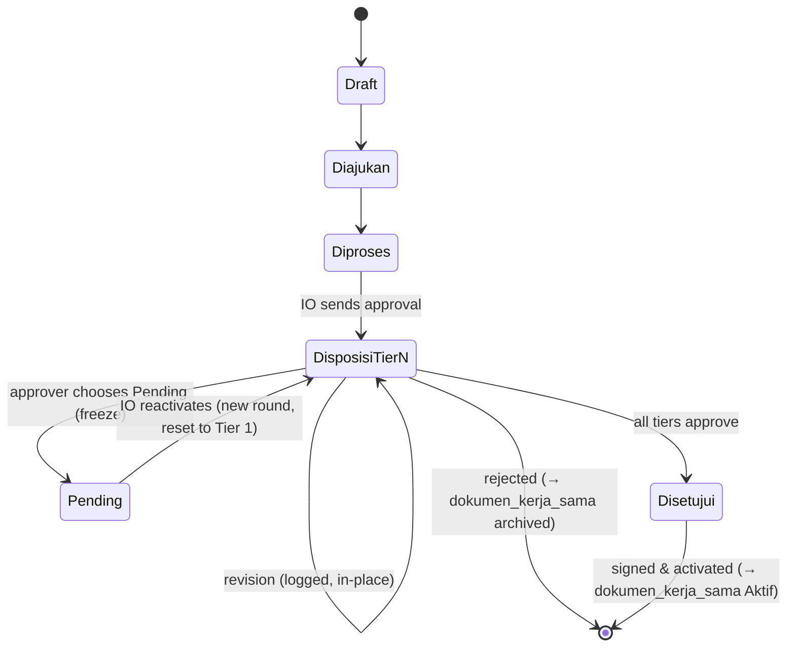

# Database Schema
## Partnership Document Management System — SIM Kerja Sama (SIM-KS)

| | |
|---|---|
| **Version** | 3.0 — aligned to the team's actual `database-sim-ks-2.mwb` model |
| **Owner** | International Office (KUI), Petra Christian University |
| **Companion documents** | Master PRD · Architecture · Design · Rules · `database-sim-ks-2.mwb` · SIM-KS UI mockups |
| **Platform** | MySQL/MariaDB (as modeled in MySQL Workbench) |

---

## 0. Source of truth & the three overrides

This schema **follows the team's `.mwb` model** as the base — its table names (Indonesian), integer surrogate keys, and structure. It supersedes the earlier inferred v2 schema, including the short-lived "`units.code` as primary key" change (the `.mwb` uses integer `id` throughout, so that is reverted).

Three deliberate **overrides** to the `.mwb`, decided with the product owner:

1. **Accounts are role-based, not person-based.** The `.mwb`'s `pegawai` (employee, keyed by `nip`) is replaced by `akun` — a login account tied to a **position** (`jabatan`), using a role email. Workflow/audit tables reference the acting position/account, not a person. (The one place a real person's name is still recorded is a document's PETRA signatory — captured as text, like the partner signatory already is.)
2. **The evaluation is structured, not a single text sheet.** The `.mwb`'s `evaluasi.lembar_evaluasi` (one TEXT blob) is expanded into Likert columns so the expectation-vs-satisfaction gap analytics (goal G8) can be queried. A `partner_eval_token` table is added for the no-login partner link.
3. **The unit hierarchy is one self-referential table with arbitrary depth.** The `.mwb`'s two tables (`parent_unit` + `unit`) are merged into a single `unit` with `id_parent_unit → unit.id`, so Faculty → Prodi → Program (and deeper) all fit — matching the "Buat Kerja Sama" Lingkup tree.

Everything else keeps the `.mwb`'s shape. New tables the UI/decisions require but the `.mwb` lacks are marked **[NEW]**; overridden tables are marked **[OVERRIDE]**; the rest are **[.mwb]**.

Conventions: `id INT UNSIGNED AUTO_INCREMENT PK` unless noted; FKs named `id_<table>`; Indonesian names carry an English gloss.

---

## 1. Entity overview

```mermaid
erDiagram
    jenis_unit ||--o{ unit : types
    unit ||--o{ unit : "parent of"
    unit ||--o{ jabatan : has
    jabatan ||--o{ akun : "logged in as (role-based)"
    negara ||--o{ partner : "located in"
    jenis_mitra ||--o{ partner : categorizes
    partner ||--o{ partner_contact : has
    partner ||--o| partner : "primary contact"
    proposal_dokumen ||--o{ partner_pengusul : "partners"
    partner ||--o{ partner_pengusul : "on"
    proposal_dokumen ||--o{ pengusul : "proposing positions"
    proposal_dokumen ||--o{ proposal_dokumen_unit : "scope (Lingkup)"
    unit ||--o{ proposal_dokumen_unit : "in scope"
    proposal_dokumen ||--o{ proposal_dokumen_agenda : agenda
    agenda ||--o{ proposal_dokumen_agenda : on
    proposal_dokumen ||--o{ proposal_dokumen_bidang : bidang
    bidang_kerjasama ||--o{ proposal_dokumen_bidang : on
    proposal_dokumen ||--o| proposal_dokumen_mou : "if MoU"
    proposal_dokumen ||--o| proposal_dokumen_moa : "if MoA"
    proposal_dokumen ||--o| proposal_dokumen : renews
    proposal_dokumen ||--o{ disposisi : "routed via"
    disposisi ||--o{ disposisi_target : targets
    jabatan ||--o{ disposisi_target : "target position"
    disposisi_target ||--o{ riwayat_approval : logs
    proposal_dokumen ||--o{ revisi_proposal : revisions
    proposal_dokumen ||--o| dokumen_kerja_sama : "becomes, when active"
    dokumen_kerja_sama ||--o{ penandatangan_petra : "PETRA signers"
    dokumen_kerja_sama ||--o{ penandatangan_partner : "partner signers"
    dokumen_kerja_sama ||--o{ evaluasi : "evaluated by (renewal)"
    evaluasi ||--o| partner_eval_token : "accessed via"
    proposal_dokumen ||--o{ notifikasi : notifies
    proposal_dokumen ||--o{ pending_periods : "frozen during"
```

---

## 2. Master data

### 2.1 `negara` (country) [.mwb]
| Column | Type | Notes |
|---|---|---|
| `id` | INT PK | |
| `kode` | VARCHAR(3) NN | e.g. `IDN`, `KOR` |
| `nama` | VARCHAR(100) NN | e.g. "Indonesia" |
| `is_domestic` | TINYINT NN DEFAULT 0 | **[added]** true only for Indonesia; the canonical domestic/international source. `partner.is_international` is set from this |

### 2.2 `jenis_unit` (unit type) [.mwb]
| Column | Type | Notes |
|---|---|---|
| `id` | INT PK | |
| `jenis` | VARCHAR(100) NN | "Unit Akademik" / "Unit Pembantu" (UA/UP) |

### 2.3 `unit` [OVERRIDE — merges `.mwb` `parent_unit` + `unit`]
Single self-referential tree (Faculty → Prodi → Program, arbitrary depth).
| Column | Type | Notes |
|---|---|---|
| `id` | INT PK | |
| `nama` | VARCHAR(150) NN | |
| `id_parent_unit` | INT NULL FK → unit.id | NULL at the top (Faculty level); points to the parent otherwise |
| `id_jenis_unit` | INT NN FK → jenis_unit.id | UA/UP |
| `is_active` | TINYINT NN DEFAULT 1 | |

Index: `INDEX(id_parent_unit)`. The Lingkup cascade walks descendants recursively via `id_parent_unit`; depth is not fixed.

### 2.4 `jabatan` (position) [.mwb]
Drives the approval hierarchy.
| Column | Type | Notes |
|---|---|---|
| `id` | INT PK | |
| `nama` | VARCHAR(150) NN | e.g. "Dekan Fakultas Teknologi Industri" |
| `id_unit` | INT NN FK → unit.id | the unit this position belongs to / heads |
| `tier_disposisi` | TINYINT NULL | **1–3, or NULL for non-approver positions.** Stored explicitly, never inferred from `nama` |

Tiers: 1 = Head of IO + Kepala Bagian Sekretariat Rektorat · 2 = Dekan / Ka. Prodi / Ka. Program / Ka. UP · 3 = Wakil Rektor + Rektor (parallel).

### 2.5 `akun` (account) [OVERRIDE — replaces `.mwb` `pegawai`]
**Role-based login accounts.** The account *is* the position, so an office-holder change needs no data change and audit identifies positions, not individuals.
| Column | Type | Notes |
|---|---|---|
| `id` | INT PK | |
| `id_jabatan` | INT NN FK → jabatan.id | the position this account represents |
| `email` | VARCHAR(150) NN UNIQUE | role email, e.g. `dekan-fti@petra.ac.id` |
| `password` | VARCHAR(255) NN | |
| `role` | VARCHAR(30) NN | app role: `submitter` / `io_staff` / `io_admin` / `viewer` |
| `is_active` | TINYINT NN DEFAULT 1 | |

> "Approver" is never stored here — it is derived per document from an open `disposisi_target` matching the account's `id_jabatan`.

### 2.5a `jenis_mitra` (partner category) [NEW]
| Column | Type | Notes |
|---|---|---|
| `id` | INT PK | |
| `nama` | VARCHAR(150) NN UNIQUE | Pendidikan / Industri / Organisasi-Yayasan-Asosiasi / Lembaga Pemerintahan / Perorangan-Kedutaan-Gereja |

### 2.6 `partner` (mitra) [.mwb — a few added columns]
| Column | Type | Notes |
|---|---|---|
| `id` | INT PK | |
| `nama` | VARCHAR(200) NN | |
| `is_international` | TINYINT NN | authoritative flag the KPI reads; set from `negara.is_domestic` |
| `id_negara` | INT NN FK → negara.id | |
| `id_jenis_mitra` | INT NULL FK → jenis_mitra.id | **[NEW]** partner's own category; distinct from `is_international`, which the UI separately labels "Jenis Mitra" for domestic/international |
| `kota` | VARCHAR(100) | |
| `alamat` | VARCHAR(255) | |
| `homepage` | VARCHAR(255) | also used for duplicate detection |
| `afiliasi_group` | VARCHAR(150) | |
| `id_partner_contact` | INT NULL FK → partner_contact.id | primary contact |
| `latitude` | DECIMAL(9,6) NULL | **[NEW]** for the "Peta Mitra Global" world map; geocoded from city/country |
| `longitude` | DECIMAL(9,6) NULL | **[NEW]** |
| `id_merged_into` | INT NULL FK → partner.id | **[NEW]** set when merged away (dedup); merged record kept, not deleted |
| `is_active` | TINYINT NN DEFAULT 1 | **[NEW]** 0 when merged away |

> **Note:** the `.mwb` dropped Fax and Year Established — consistent with the revised proposal form; not re-added. `jaringan_bisnis`/`jenis_bisnis` from the UI can live as free-text/`managed_options`; add columns only if the team wants them queryable.

### 2.7 `partner_contact` [.mwb]
| Column | Type | Notes |
|---|---|---|
| `id` | INT PK | |
| `id_partner` | INT NN FK → partner.id | |
| `nama` | VARCHAR(150) NN | |
| `jabatan` | VARCHAR(150) | free text — partner titles aren't in our master |
| `email` | VARCHAR(150) | |
| `no_telp` | VARCHAR(30) | |

### 2.8 `agenda` (cooperation type) [.mwb — one added column]
| Column | Type | Notes |
|---|---|---|
| `id` | INT PK | |
| `nama` | VARCHAR(200) NN | ~64 types |
| `is_amendment` | TINYINT NN DEFAULT 0 | **[added]** flags "Adendum/Amandemen" so the addendum path is detected without string-matching |

### 2.9 `bidang_kerjasama` (field of cooperation) [.mwb]
| Column | Type | Notes |
|---|---|---|
| `id` | INT PK | |
| `nama` | VARCHAR(50) NN | Pembelajaran / Penelitian / Abdimas / Kemahasiswaan / Kelembagaan |

### 2.10 `tujuan_kerjasama` / `manfaat_petra` / `manfaat_mitra` [NEW]
Dedicated dropdown tables backing the proposal form's Tujuan Kerjasama and Manfaat bagi PETRA/Mitra fields — a plain `select` per field, seeded from the historical import (TUJUAN_KERJASAMA.csv, MANFAAT_BAGI_PETRA.csv, MANFAAT_BAGI_MITRA.csv). Each has the same shape:
| Column | Type | Notes |
|---|---|---|
| `id` | INT PK | |
| `nilai` | VARCHAR(1000) NN UNIQUE | the option text |
| `is_active` | TINYINT NN DEFAULT 1 | deactivated in the admin area, never deleted while a document still references it |

> The chosen value is still stored denormalized on `proposal_dokumen` (as the `.mwb` does with `manfaat_*`); these tables only source the dropdown.

### 2.10a `managed_options` [NEW]
Now scoped to `jabatan_freetext` only (the other three groups moved to their own tables above).
| Column | Type | Notes |
|---|---|---|
| `id` | INT PK | |
| `option_group` | VARCHAR(30) NN | `jabatan_freetext` |
| `value` | VARCHAR(1000) NN | |
| `usage_count` | INT NN DEFAULT 0 | |
| `id_merged_into` | INT NULL FK → managed_options.id | dedup |
| `is_active` | TINYINT NN DEFAULT 1 | |

### 2.11 `settings` [NEW]
Drives configurable thresholds the UI/SLA depend on.
| key | default | purpose |
|---|---|---|
| `expiring_soon_months` | 6 | "Akan Berakhir" window |
| `expiry_cadence` | monthly_then_weekly_2mo | repeating expiry reminders |
| `sla_yellow_days` / `sla_red_days` | 2 / 4 | approval SLA (business days) |
| `renewal_reminder_days` / `renewal_yellow_days` / `renewal_red_days` | 30 / 60 / 90 | renewal-request SLA |
| `kpi_turnaround_basis` | final_approved | KPI boundary (excludes signing) |

Table: `id PK`, `key VARCHAR(100) UNIQUE`, `value TEXT`, `updated_by INT FK akun`, `updated_at DATETIME`.

### 2.12 `holidays` [NEW]
Required for business-day approval-SLA counting. `id PK`, `tanggal DATE UNIQUE`, `keterangan VARCHAR(255)`.

### 2.13 `dashboard_chart` [NEW]
Backs "Studio Grafik Mitra" — IO Admin saves up to 5 configurable charts, viewed read-only by others.
| Column | Type | Notes |
|---|---|---|
| `id` | INT PK | |
| `judul` | VARCHAR(150) NN | e.g. "Jumlah MoU dan MoA Aktif" |
| `jenis_grafik` | VARCHAR(20) NN | batang_vertikal / batang_horizontal / donut / garis / area / radar / treemap |
| `config` | JSON NN | grouping, metric (`sumber_data`), stack, ordering, max categories, and the Filter Data set (region/status/dokumen/fakultas) |
| `urutan` | SMALLINT NN | display order (≤5) |
| `is_visible` | TINYINT NN DEFAULT 1 | |
| `id_akun_pembuat` | INT FK → akun.id | |

> Status/archive is one of the in-`config` filters (defaults to active), not a global toggle.

---

## 3. Proposal core

### 3.1 `proposal_dokumen` (proposal) [.mwb — added columns]
One row per proposal; on activation it links to a `dokumen_kerja_sama`.
| Column | Type | Notes |
|---|---|---|
| `id` | INT PK | |
| `jenis_kerjasama` | ENUM('MoU','MoA') NN | |
| `periode_kerjasama` | VARCHAR(50) | e.g. "5 Tahun" |
| `sifat_periode_kerjasama` | VARCHAR(45) | "Kedua Belah Pihak" / "Auto Renewed" |
| `status_proposal` | VARCHAR(30) NN | see §3.2 |
| `tujuan_kerjasama` | TEXT | **[added]** from `tujuan_kerjasama` (§2.10) — the UI shows this dropdown |
| `manfaat_bagi_petra` | TEXT | from `manfaat_petra` (§2.10) |
| `manfaat_bagi_mitra` | TEXT | from `manfaat_mitra` (§2.10); **single shared value even on multi-partner** |
| `informasi_tambahan` | TEXT | **[added]** the UI's "Informasi Tambahan" |
| `id_dokumen_sebelumnya` | INT NULL FK → proposal_dokumen.id | predecessor on a renewal (Perpanjangan) |
| `waktu_proposal_dokumen` | DATETIME NN | submission time — start of turnaround KPI |
| `waktu_disetujui` | DATETIME NULL | **[added]** last approval — the "< 1 bulan" KPI boundary (excludes signing) |
| `waktu_aktif` | DATETIME NULL | **[added]** activation time (captured, not the KPI boundary) |
| `status_sla` | VARCHAR(30) | current SLA flag summary for the proposal |

Constraint: `sifat_periode_kerjasama='Auto Renewed'` ⇒ the eventual `dokumen_kerja_sama.tanggal_berakhir` is NULL (enforced in app).

### 3.2 Proposal status vocabulary (from the UI)
`status_proposal` values seen in the mockups: **Draft · Diajukan · Diproses · Disposisi - Tier 1 · Disposisi - Tier 2 · Disposisi - Tier 3 · Pending · Disetujui · Pembaruan**. "Disposisi - Tier N" is the in-disposition state with the current tier surfaced for display; the tier is derived from the open `disposisi_target` rows, not stored on the proposal.

### 3.3 `proposal_dokumen_bidang` [.mwb] — join to `bidang_kerjasama`
`id_proposal_dokumen`, `id_bidang_kerjasama` (PK pair).

### 3.4 `proposal_dokumen_agenda` [.mwb] — join to `agenda`
`id_proposal_dokumen`, `id_agenda` (PK pair).

### 3.5 `proposal_dokumen_mou` [.mwb]
`id_proposal_dokumen` (PK/FK), `ringkasan_kegiatan TEXT NN` (MoU-only summary).

### 3.6 `proposal_dokumen_moa` [.mwb]
`id_proposal_dokumen` (PK/FK), `hak_petra`, `hak_calon_mitra`, `kewajiban_petra`, `kewajiban_calon_mitra` (all TEXT NN) — MoA-only rights/obligations.

### 3.7 `partner_pengusul` [.mwb] — document ↔ partner (multi-partner)
`id_partner`, `id_proposal_dokumen` (PK pair). Used even for single-partner documents. **[add]** `is_lead TINYINT DEFAULT 0` — the lead partner (whose evaluation is collected on a multi-partner renewal).

### 3.8 `pengusul` [.mwb] — proposing position(s)
`id_jabatan`, `id_proposal_dokumen` (PK pair). The Section II proposing unit/contact.

### 3.9 `proposal_dokumen_unit` [.mwb] — Lingkup Kerja Sama (scope)
`id_proposal_dokumen`, `id_unit` (PK pair). Stores the **explicit set** of selected units from the recursive cascade; a parent's indeterminate (partial) state is derived at read time, never stored.

---

## 4. Active document

### 4.1 `dokumen_kerja_sama` (active cooperation document) [.mwb — added columns]
| Column | Type | Notes |
|---|---|---|
| `no` | INT PK | |
| `id_proposal_dokumen` | INT NN FK → proposal_dokumen.id | |
| `no_dokumen` | VARCHAR(50) NULL | **[added]** e.g. "2487/UKP/2025" — entered by IO, never generated (shown in the UI table) |
| `tanggal_tanda_tangan` | DATE | signing date |
| `tanggal_mulai` | DATE | start |
| `tanggal_berakhir` | DATE NULL | end; **NULL for Auto Renewed** |
| `status` | VARCHAR(30) NN | Aktif / Akan Berakhir / Kedaluarsa / Diarsipkan |
| `alasan_arsip` | VARCHAR(255) | archive reason: rejected / expired_without_renewal / superseded_by_renewal / terminated_early |
| `upload_dokumen` | VARCHAR(500) | signed file path |
| `folder_kui` | VARCHAR(100) NULL | **[added]** filing reference |
| `no_berkas_dikti` | VARCHAR(100) NULL | **[added]** compliance reference |
| `id_penandatangan_partner` | INT NULL FK → penandatangan_partner.id | primary partner signatory |

Index: `INDEX(status, tanggal_berakhir)` for the "Akan Berakhir"/expiry queries.

### 4.2 `penandatangan_petra` (PETRA signatory) [OVERRIDE — role-based]
The `.mwb` linked to `pegawai(nip)`; with role-based accounts and no person table, a signatory is captured as text (a named person signs the physical document).
| Column | Type | Notes |
|---|---|---|
| `id` | INT PK | |
| `no_dokumen_kerjasama` | INT NN FK → dokumen_kerja_sama.no | |
| `nama` | VARCHAR(150) NN | e.g. "Eddy Yusuf, Ph.D" |
| `jabatan` | VARCHAR(150) | e.g. "Director of International Office" |

### 4.3 `penandatangan_partner` (partner signatory) [.mwb]
`id PK`, `id_partner NN FK`, `no_dokumen_kerjasama NN FK`, `nama NN`, `jabatan`. Add/remove supports multi-partner documents.

---

## 5. Workflow

### 5.1 `disposisi` (disposition) [.mwb]
Two kinds share this table.
| Column | Type | Notes |
|---|---|---|
| `no` | INT PK | |
| `id_proposal_dokumen` | INT NULL FK → proposal_dokumen.id | set for approval dispositions |
| `no_dokumen_kerjasama` | INT NULL FK → dokumen_kerja_sama.no | set for renewal-request dispositions on an active document |
| `jenis_disposisi` | VARCHAR(30) NN | `approval` / `renewal_request` |
| `round_ke` | SMALLINT NN | **approval round** — increments when Pending resets the approval; the current round's targets are the live ones |
| `pesan_disposisi` | TEXT | IO's message |
| `waktu_disposisi` | DATETIME NN | |

> Branch on `jenis_disposisi`: a `renewal_request` never enters tier gating and completes when the unit uploads the renewal draft.

### 5.2 `disposisi_target` (per-position target) [.mwb]
| Column | Type | Notes |
|---|---|---|
| `no` | INT PK | |
| `no_disposisi` | INT NN FK → disposisi.no | |
| `id_jabatan` | INT NN FK → jabatan.id | the target **position**. For a `renewal_request`, this is the **owning unit's head jabatan** (renewal requests target the unit via its head position) |
| `status` | VARCHAR(30) NN | waiting / pending_action / approved / rejected |
| `batas_waktu_sla` | DATETIME NULL | SLA deadline (approval scale for approvals; 30/60/90 scale for renewal requests) |

> Tier of a target is read from `jabatan.tier_disposisi` at send time; store it here too if you want it frozen against later re-tiering (recommended). A tier unlocks when no lower-tier target in the current `round_ke` is un-approved (empty tiers skip). Removing the last un-approved target re-runs gating; approved targets can't be removed; edits allowed only while in-disposition.

### 5.3 `riwayat_approval` (approval history / audit) [OVERRIDE — role-based]
Append-only. The `.mwb` referenced `pegawai(nip)`; now it records the acting **position/account**.
| Column | Type | Notes |
|---|---|---|
| `id` | INT PK | |
| `id_disposisi_target` | INT NN FK → disposisi_target.no | which target acted (carries the position) |
| `id_akun` | INT NULL FK → akun.id | acting role account (identifies a position, not a person) |
| `aksi` | VARCHAR(50) NN | approve / reject / pending / revision_requested / reactivated / disposition_added / disposition_removed / … |
| `catatan` | TEXT | comment |
| `tanggal` | DATE NN | |
| `waktu` | TIME NN | |

> The dashboard **Activity Log** and **Discussion** tabs are read-only views over this table plus `disposisi`/`revisi_proposal` — not separate entities. "Discussion" surfaces revision requests (sender position, receiver, message); "Activity Log" surfaces the event feed ("KUI mengirim Approval ke …", "Rektor me-respond Approve", "Proposal dibuat").

### 5.4 `revisi_proposal` (revision log) [OVERRIDE — role-based uploader]
Every revision event; the file is replaced in place (no version history), this log is the trace.
| Column | Type | Notes |
|---|---|---|
| `id` | INT PK | |
| `id_proposal_dokumen` | INT NN FK | |
| `file_proposal` | VARCHAR(500) NN | draft filename after this revision |
| `id_akun_pengunggah` | INT NN FK → akun.id | the IO account that uploaded (was `nip_pengunggah`) |
| `catatan` | TEXT | |
| `waktu_unggah` | DATETIME NN | |

### 5.5 `pending_periods` [NEW] — SLA pause mechanism
Records each frozen (Pending) span so approval SLA excludes it.
`id PK`, `id_proposal_dokumen NN FK`, `mulai DATETIME NN`, `selesai DATETIME NULL`, `id_disposisi_target_pemicu INT NULL FK`, `id_akun_reaktivasi INT NULL FK akun`.

---

## 6. Renewal & evaluation

### 6.1 `evaluasi` (evaluation) [OVERRIDE — structured]
The `.mwb` stored one `lembar_evaluasi` TEXT; expanded to structured Likert so the gap analytics work. One row per (document × respondent).
| Column | Type | Notes |
|---|---|---|
| `no` | INT PK | |
| `id_dokumen_kerjasama` | INT NN FK → dokumen_kerja_sama.no | the expiring document |
| `respondent_type` | VARCHAR(10) NN | `faculty` / `partner` |
| `id_partner_contact` | INT NULL FK → partner_contact.id | partner respondent (partner side) |
| `id_jabatan_pengusul` | INT NULL FK → jabatan.id | faculty respondent position (faculty side) |
| `exp_quality` … `exp_communication` | TINYINT NULL ×5 | **expectation** Likert 1–5 (Quality, Relevance, Productivity, Sustainability, Communication) |
| `sat_quality` … `sat_communication` | TINYINT NULL ×5 | **satisfaction** Likert 1–5 |
| `rekomendasi` | VARCHAR(50) | continue / terminate (kept from `.mwb`) |
| `continuation_mode` | VARCHAR(20) NULL | same_program / add_program |
| `catatan_evaluasi` | TEXT | continuation detail or feedback |
| `respondent_nama` / `respondent_email` | VARCHAR NULL | partner-side accountability record (no-login form) |
| `form_revision` | VARCHAR(30) | e.g. `F03-PM03-KUI-UKP-00`; frozen per submission |
| `status` | VARCHAR(20) NN DEFAULT 'pending' | pending / submitted / superseded |
| `id_supersedes` | INT NULL FK → evaluasi.no | a reopened re-submission links to the answer it replaced |
| `waktu_evaluasi` | DATETIME NN | |

> Analytics keep each aggregate's link back to `id_dokumen_kerjasama` for drill-down. On a multi-partner renewal there is one partner evaluation, for the lead partner.

### 6.2 `partner_eval_token` [NEW] — no-login partner access
`id PK`, `id_evaluasi NN FK → evaluasi.no`, `token CHAR(64) UNIQUE`, `is_active TINYINT DEFAULT 1`, `id_akun_pengirim INT FK akun`, `waktu_kirim DATETIME`, `waktu_submit DATETIME NULL`, `waktu_reopen DATETIME NULL`, `id_akun_reopen INT NULL FK akun`.
Valid until submitted, then inert; reopen supersedes the old evaluation and issues a fresh token; token resolves server-side to exactly one evaluation, exposes nothing else.

---

## 7. Notifications

### 7.1 `notifikasi` [.mwb]
| Column | Type | Notes |
|---|---|---|
| `id` | INT PK | |
| `id_proposal_dokumen` | INT NULL FK | |
| `no_dokumen_kerjasama` | INT NULL FK | |
| `jenis_notifikasi` | VARCHAR(50) NN | disposition_assigned / approved / pending / revision_requested / rejected / expiring_soon / sla_yellow / sla_red / renewal_request_sla / evaluation_submitted / split_decision |
| `waktu_kirim` | DATETIME | |
| `status` | VARCHAR(30) NN | in-app read / email-sent state |

> Add a recipient (`id_akun` or `id_jabatan`) if notifications should target a specific inbox rather than being derived; the `.mwb` leaves recipient implicit — recommend adding `id_jabatan_penerima INT NULL FK`.

---

## 8. Feasibility check — UI ↔ schema

Every screen in the SIM-KS mockups is buildable against this schema; notes on the few that need something extra:

| UI element | Backed by | Feasible? |
|---|---|---|
| Dashboard KPI cards (Aktif 876, Mitra Intl 183 / Domestik 678, Akan Kadaluarsa 15, Dalam Proses 25, Melewati SLA 5, < 1 Bulan 75%) | counts over `dokumen_kerja_sama` (by `status`) and `partner.is_international`; SLA from `disposisi_target`/`status_sla`; turnaround from `waktu_proposal_dokumen`→`waktu_disetujui` | Yes |
| **Peta Mitra Global** (world map with pins, Intl/Domestik toggle, region tabs) | `partner.latitude/longitude` (**new — needs geocoding**), `is_international`, `id_negara` | Yes, once coordinates are populated |
| **Studio Grafik Mitra** (up to 5 configurable charts, filters) | `dashboard_chart.config` | Yes |
| Discussion tab (revision requests) | view over `disposisi`(+message)/`revisi_proposal` + `riwayat_approval` | Yes |
| Activity Log | view over `riwayat_approval` + `disposisi` + `notifikasi` | Yes |
| Cari Kerja Sama tabs (Aktif / Proposal / Disetujui / Akan Berakhir / Pembaruan / Arsip) + per-column filter + Countdown + Evaluasi links | `dokumen_kerja_sama.status`/`tanggal_berakhir` (countdown derived), `proposal_dokumen.status_proposal`, `evaluasi` | Yes |
| Buat Kerja Sama — Lingkup recursive tri-state tree | `unit` self-ref + `proposal_dokumen_unit` | Yes |
| Document detail tabs (Detail / Approval / History / Disposition) + embedded doc preview + "Tolak Pengajuan" | `proposal_dokumen`(+moa/mou), `disposisi`/`disposisi_target`, `riwayat_approval`, `upload_dokumen` | Yes |
| Status "Disposisi - Tier N" inline | derived from open `disposisi_target` in current `round_ke` | Yes |
| Structured renewal evaluation + gap analytics | `evaluasi` (structured, §6.1) | Yes (this is why the override was needed) |

**No infeasible requirements.** The only genuinely new data dependency is partner **coordinates** for the world map; everything else is standard querying.

---

## 9. Deltas from the `.mwb` (for the DB owner)

Apply these to `database-sim-ks-2.mwb`:
1. **Merge** `parent_unit` into a self-referential `unit` (`id_parent_unit → unit.id`, `id_jenis_unit`); repoint `jabatan.id_unit` and `proposal_dokumen_unit.id_unit` to it.
2. **Replace** `pegawai` with `akun` (role/jabatan-based); repoint `riwayat_approval`, `revisi_proposal` to `akun`; convert `penandatangan_petra` to `nama`/`jabatan` text.
3. **Expand** `evaluasi.lembar_evaluasi` into the Likert + respondent + status columns (§6.1); add `partner_eval_token`.
4. **Add** columns: `dokumen_kerja_sama.no_dokumen`, `folder_kui`, `no_berkas_dikti`; `proposal_dokumen.tujuan_kerjasama`, `informasi_tambahan`, `waktu_disetujui`, `waktu_aktif`; `agenda.is_amendment`; `negara.is_domestic`; `partner.latitude/longitude/id_merged_into/is_active`; `partner_pengusul.is_lead`.
5. **Add** tables: `akun`, `managed_options`, `settings`, `holidays`, `dashboard_chart`, `partner_eval_token`, `pending_periods`.
6. Optionally add `disposisi_target.tier` (frozen tier) and `notifikasi.id_jabatan_penerima`.

---

## 10. Forward compatibility (Realization System)
Unchanged: a future Implementation Arrangement references exactly one **Active** `dokumen_kerja_sama` (one-to-many); on renewal, linkage transfers from the archived predecessor to the successor, preserving the Active-only rule. No change to the tables above is required.
